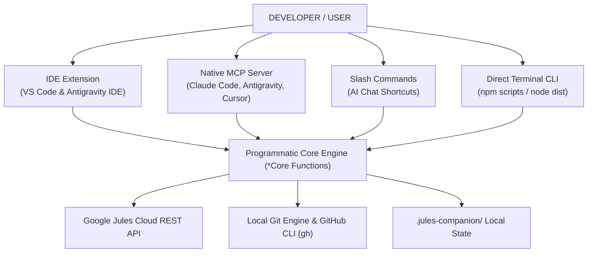
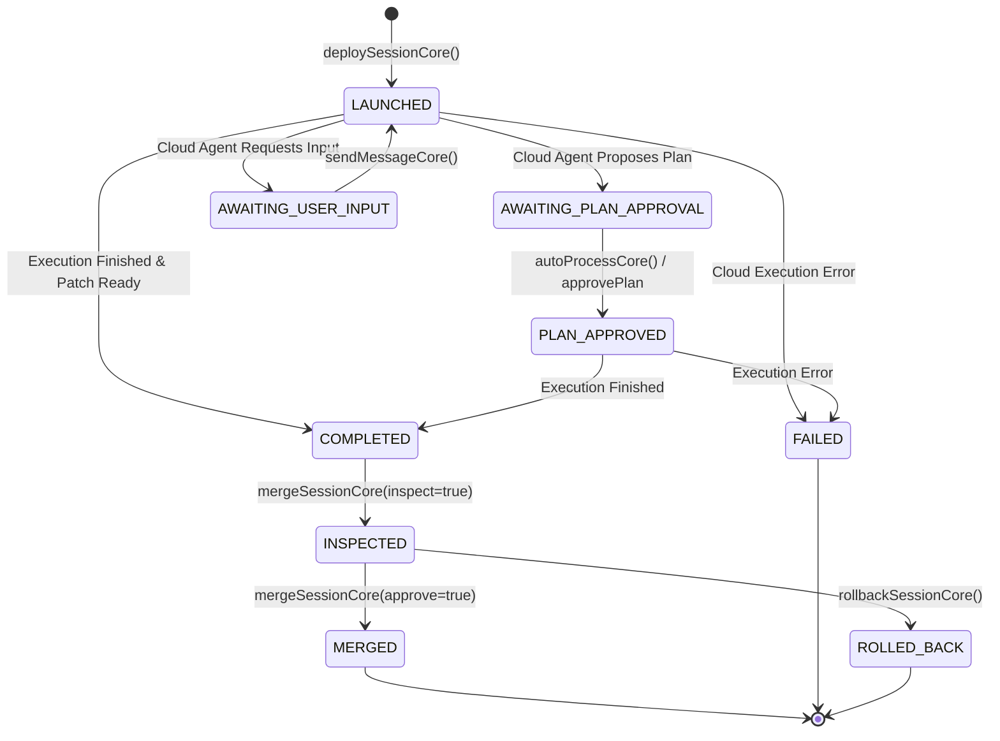
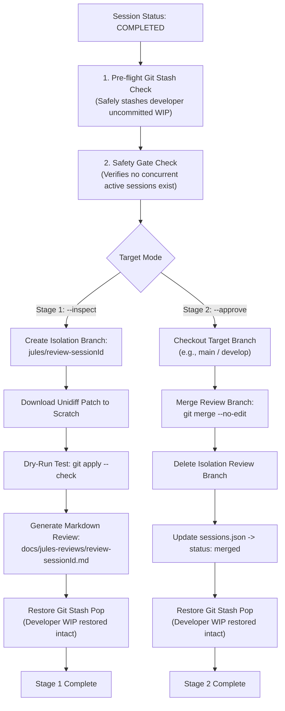

# Jules Companion - Comprehensive Application Guide & Architecture Overview

**Jules Companion** (`jules-companion`, version **1.5.0**) is an intelligent AI co-pilot, orchestration platform, and multi-modal development toolkit built with TypeScript. It provides a robust, resilient bridge coordinating interactions between local developers (across IDEs, terminals, Git workflows, and AI agents) and the **Google Jules Cloud REST API** (an autonomous cloud sandbox execution environment) along with the GitHub CLI (`gh`).

The application automates the entire cloud session lifecycle: isolated branch reviews, in-editor visual diffs (`jules-diff://`), unidiff patch extraction, two-stage safe merges with pre-flight `git stash` preservation, periodic task scheduling, and a roster of **63 specialized domain AI agents**.

---

## 1. Four Interaction Modalities

Jules Companion is designed with a modular architecture accessible through four complementary modalities:



### A. Native VS Code & Antigravity IDE Extension
A visual development environment embedded directly into the editor's Activity Bar:
- **4 Interactive Sidebar Views**: *Workspace Context*, *Sessions Tree*, *Agent Roster*, and *Journals & Reports*.
- **In-Editor Visual Diff Viewer**: Side-by-side visual comparison of file modifications using a virtual document content provider (`jules-diff://`) without modifying the working tree.
- **Interactive Action Center**: QuickPick menu for deploying sessions, approving plans, replying to agent questions, creating GitHub PRs, pulling diffs, and deleting sessions.
- **Task Scheduler**: Configurable recurring task execution directly within the IDE interface.
- **Real-Time Status Bar**: Dynamic status indicator showing active session states, prompts awaiting reply, and one-click navigation.

### B. Native Model Context Protocol (MCP) Server
- Natively connects with Antigravity IDE, Claude Code, OpenCode, Cursor, and Windsurf.
- Exposes **20 built-in MCP tools** called autonomously by LLMs via standard JSON-RPC over stdio.
- Run using:
  ```bash
  npm run mcp
  # or: node dist/mcp_server.js
  ```

### C. Slash Commands (AI Chat Shortcuts)
Enables conversational execution of complex orchestration flows directly from the AI chat prompt:
- `/jules-deploy <agent> "<task>"`: Deploys an autonomous cloud coding session.
- `/jules-review <agent> "<task>"`: Deploys an audit-only session producing a structured Markdown review in `docs/jules-reviews/`.
- `/jules-auto`: Runs an autonomous polling loop to approve plans (`approvePlan`) and answer pending prompts.
- `/jules-inspect <sessionId>`: Downloads patch to an isolated review branch (`jules/review-...`) and creates an evaluation report.
- `/jules-merge <sessionId>`: Safely merges an inspected session into the target branch.
- `/jules-status`: Displays a formatted status table of all registered local sessions.

### D. Direct Terminal CLI (npm scripts)
Provides low-level scriptable access for terminal workflows and CI/CD pipelines:
```bash
npm run setup                                # Initialize local staging workspace
npm run deploy -- --type start --agents bolt --task "Optimize query indices"
npm run merge -- --inspect <sessionId>       # Stage 1: Inspect patch on isolated branch
npm run merge -- --approve <sessionId>       # Stage 2: Merge into main branch
npm run client -- list                       # Query sessions via Google Jules API
npm run client -- get <sessionId>            # Fetch detailed activity log
```

---

## 2. Universal 1-Click Multi-Agent & IDE Installer

Jules Companion features an automated universal installer (`scripts/installer.js`) that detects all installed AI agents and code editors, deploying skills, MCP servers, slash commands, and VSIX extensions in a single command:

```bash
# Windows (PowerShell or Double-Click install.bat)
npm run installer
# or: .\install.ps1

# Linux / macOS
./install.sh
```

### What the Universal Installer Configures Automatically:
1. **IDE Extensions (VSIX)**:
   - Automatically discovers and installs the `.vsix` package into **Antigravity IDE**, **Visual Studio Code**, **Cursor**, and **Windsurf**.
2. **AI Agent Skills (Cross-Platform)**:
   - Deploys `SKILL.md` and reference prompts to:
     - **Google Antigravity**: `~/.gemini/skills/jules-companion/`, `~/.gemini/config/skills/`, and workspace `.agents/skills/`.
     - **Anthropic Claude Code**: `~/.claude/skills/jules-companion/`.
     - **GitHub Copilot CLI**: `~/.copilot/skills/jules-companion/`.
     - **OpenClaw Agent**: `~/.openclaw/skills/jules-companion/`.
     - **Pi Coding Agent**: `~/.pi/agent/skills/jules-companion/`.
     - **Hermes Agent**: `~/.hermes/skills/jules-companion/`.
3. **Interactive Slash Commands (`/jules-*`)**:
   - Registers all 7 markdown commands into `~/.gemini/commands/`, `~/.gemini/config/commands/`, and `~/.claude/commands/`.
4. **Model Context Protocol (MCP) Server**:
   - Safely updates MCP configuration files without overwriting existing tools:
     - Google Antigravity (`~/.gemini/config/mcp_config.json`)
     - Claude Desktop (`claude_desktop_config.json` on Windows/macOS/Linux)
     - Claude Code (`~/.claude/mcp.json`)
     - Cursor AI (`~/.cursor/mcp.json`)
     - Windsurf (`~/.codeium/windsurf/mcp_config.json`)
     - Exports JSON schemas for Antigravity schema discovery.
5. **Interactive API Key Setup**:
   - Validates `JULES_API_KEY` in `.env`, prompting the user interactively if not yet set.

---

## 3. Complete 20 Model Context Protocol (MCP) Tools Catalog

The MCP tool catalog (`scripts/mcp/registry.ts`) is organized into 5 functional domains:

### I. Session Lifecycle & Deployment (6 Tools)
1. **`deploy_session`**: Deploys a new cloud coding session (`start`, `review`, or `interactive` mode) with specified agent and task.
2. **`deploy_team`**: Orchestrates multi-agent teams using battle-tested presets (`github-ops`, `full-audit`, `feature-sprint`, `refactor-boost`).
3. **`cancel_session`**: Cancels an active or queued session on the Google Jules server.
4. **`retry_failed_session`**: Retries a failed session using the same context and prompt.
5. **`get_session_status`**: Retrieves live runtime status (`state`, `url`, `activities`) from the Google Jules API.
6. **`auto_process`**: Autonomously polls cloud sessions, auto-approving plans and answering clarification requests.

### II. Code Review & Git Integration (6 Tools)
7. **`merge_session`**: Executes Stage 1 inspection (`inspect: true`) or Stage 2 final merge (`approve: true`).
8. **`pull_session_diff`**: Extracts raw unidiff patch into `.jules-companion/scratch/` without checking out branches.
9. **`checkout_session_branch`**: Creates an isolated feature branch (`jules/<agent>-<sessionId>`) and applies the patch.
10. **`rollback_session`**: Rolls back merged changes safely or restores orphaned git stash entries.
11. **`create_github_pr`**: Submits a formal GitHub Pull Request using GitHub CLI (`gh`) for completed sessions.
12. **`get_review_reports`**: Scans and indexes audit reports from `docs/jules-reviews/`.

### III. Human-in-the-Loop Feedback (1 Tool)
13. **`send_session_message`**: Sends instructions, architectural decisions, or contextual replies to an active session.

### IV. Specialist Agent Personas (4 Tools)
14. **`list_agents`**: Lists all 63 specialist agent personas with descriptions, roles, and functional domains.
15. **`get_agent_info`**: Retrieves system prompts, behavioral guidelines, and instructions for a specific agent persona.
16. **`create_custom_agent`**: Scaffolds a new custom agent prompt file and updates `registry.json`.
17. **`read_agent_journal`**: Reads historical execution journals recorded by agents under `.jules/`.

### V. Workspace Diagnostics & Management (3 Tools)
18. **`setup_workspace`**: Scaffolds local staging environment (`.jules-companion/`, `.gitignore`, `sessions.json`).
19. **`list_sources`**: Lists GitHub repositories connected to the authenticated Google Jules account.
20. **`run_doctor`**: Performs comprehensive system diagnostics (.env, API keys, Git remote, GitHub CLI, Node.js, MCP).

---

## 4. Specialist Agent Roster (63 Agents Across 11 Functional Clusters)

Jules Companion implements **63 specialist agent personas** (cataloged in [references/agents/registry.json](file:///E:/Data%20Utama/Coding/Antigravity/Jules-Companion/references/agents/registry.json)). The roster is structured into **36 Coding & Architecture Specialists** and **27 Advisory, Review & Documentation Specialists**, mapped across **11 Functional Clusters**:

| Functional Cluster | Count | Specialist Agents | Core Domain Focus |
| :--- | :---: | :--- | :--- |
| **1. Core & Architecture** | 8 | `builder`, `bridge`, `conduit`, `decoupler`, `consolidator`, `monorepist`, `nexus`, `smith` | Architectural decomposition, dependency boundary enforcement, monorepo orchestration, and core abstractions. |
| **2. Refactoring & Modernization** | 6 | `alchemist`, `modernizer`, `innovator`, `chameleon`, `nomad`, `proteus` | Legacy code refactoring, runtime migrations, API deprecation handling, and design pattern upgrades. |
| **3. Performance & Optimization** | 6 | `bolt`, `speedster`, `benchmarker`, `slimmer`, `pruner`, `scaler` | Latency reduction, memory optimization, bundle size minimization, load benchmarking, and scale tuning. |
| **4. Security & Governance** | 5 | `gatekeeper`, `sentinel`, `enforcer`, `hermetic`, `attestor` | Security audits, input sanitization, hermetic sandbox enforcement, compliance checks, and attestation. |
| **5. Quality Assurance & Testing** | 5 | `exterminator`, `inspector`, `mutator`, `grader`, `sleuth` | Unit test synthesis, mutation testing, deep bug hunting, edge-case validation, and QA scorecards. |
| **6. Maintenance & Hygiene** | 5 | `janitor`, `logger`, `watcher`, `standardizer`, `revenant` | Dead code pruning, structured logging standardization, telemetry monitoring, and artifact housekeeping. |
| **7. Packaging & Infrastructure** | 7 | `dockerist`, `packager`, `plugger`, `adapter`, `netrunner`, `octo`, `vscecraft` | Docker containerization, VSIX/npm packaging, plugin architecture, network integration, and CI/CD pipelines. |
| **8. UI, UX & Styling** | 3 | `materialist`, `palette`, `green` | Visual interface design, theme tokens, layout geometry, web accessibility (a11y), and energy-efficient rendering. |
| **9. Planning & Strategy** | 5 | `planner`, `scoper`, `consultant`, `critic`, `guildmaster` | Complex task decomposition, scope boxing, trade-off analysis, technical roadmapping, and review moderation. |
| **10. Documentation & Knowledge** | 7 | `scribe`, `annotator`, `archivist`, `curator`, `explainer`, `lexicon`, `cartographer` | Technical documentation, architecture mapping, code glossaries, knowledge synthesis, and docstring auditing. |
| **11. Data & VCS Integration** | 5 | `datasmith`, `gitsmith`, `localizer`, `synapse`, `specifier` | Schema engineering, advanced Git branching workflows, i18n localization, and formal interface specification. |

Each agent persona is defined by an individual system prompt template located in `references/agents/<agent-name>.md`, injected into the Google Jules cloud execution environment upon session dispatch.

---

## 5. Cloud Session Lifecycle Finite State Machine (FSM)

Task execution in the Google Jules VM sandbox transitions through a strictly governed state machine:



- **`AWAITING_PLAN_APPROVAL`**: The agent analyzes the codebase, generates an execution plan listing files to be created or modified, and waits for confirmation. The `auto_process` daemon or IDE action triggers `POST ...:approvePlan`.
- **`AWAITING_USER_INPUT`**: The agent requires architectural clarification or design direction. Developers reply via the IDE Action Center, chat prompt, or MCP tool `send_session_message`.
- **`COMPLETED`**: Code generation is complete; a unidiff patch artifact is ready for inspection.

---

## 6. Two-Stage Git Safety Gate & Merge Engine

To guarantee zero local repository corruption, `scripts/merge_session.ts` implements a multi-step safety protocol:



### Safety Guarantees:
1. **Zero Data Loss**: Uncommitted local developer modifications are always protected via a uniquely tagged `git stash` before any branch switching occurs, and restored via `git stash pop` upon exit.
2. **Cross-Session Conflict Prevention (Safety Gate)**: Blocks merges if concurrent active sessions are detected modifying code to avoid clobbering simultaneous changes.
3. **Isolated Branch Verification**: Cloud patches are never applied directly to active working branches without preliminary trial application on dedicated isolation branches (`jules/review-...`).

---

## 7. Advanced IDE Extension Features

The Jules Companion extension seamlessly connects developers with cloud tasks:

1. **Workspace Context Inspector**:
   - Continuously evaluates the active Git branch, latest commit hash, GitHub remote URL, Jules API credentials, GitHub CLI status, and workspace health.
2. **Hierarchical Sessions Tree**:
   - Organizes active, completed, and archived sessions in collapsible tree views.
   - Provides granular sub-items for multi-step execution plans, diff artifacts, and contextual action buttons.
3. **In-Editor Visual Diff Viewer**:
   - Virtual document content provider (`jules-diff://`) presents clean side-by-side file comparisons inside the editor without modifying local worktrees.
4. **Interactive Action Center**:
   - QuickPick command center for:
     - 🚀 *Deploy New Session*
     - 🔍 *Inspect & View Visual Diff*
     - ✅ *Approve Plan / Reply to Agent*
     - 🔀 *Merge into Current Branch*
     - 📦 *Create GitHub Pull Request*
     - 🗑️ *Archive / Purge Session*
5. **Integrated Task Scheduler**:
   - Schedule recurring audits, code health scans, or maintenance jobs via `jules.scheduleTask`.
   - Manage task queues, view details, force run immediately, or cancel active schedules.
6. **Activity Log Streaming**:
   - Dedicated `Jules Activity` output channel streaming real-time cloud VM events and logs.

---

## 8. Directory Structure & State Persistence

All internal states are cleanly isolated in a git-ignored directory:

```
<project-root>/
├── .jules-companion/             # [GIT-IGNORED] Internal staging folder
│   ├── config.json               # Platform configuration and version metadata
│   ├── sessions.json             # Local session database (atomic file writes)
│   ├── references/               # Local cache of agent prompt templates
│   │   └── agents/*.md           # 63 agent prompt files
│   └── scratch/                  # Temporary patch and diff files (*.patch, *.diff)
│       └── <sessionId>/          # Per-session scratch buffers
├── docs/
│   ├── jules-reviews/            # Generated Markdown audit reports
│   ├── application-overview.md   # This document
│   ├── codebase-architecture-map.md
│   ├── development-and-contribution-guide.md
│   ├── mcp-tools-catalog.md
│   └── specialist-agents-catalog.md
├── graphify-out/                 # [GRAPHIFY] Knowledge Graph & Visualizer
│   ├── graph.json                # Code relationship AST graph
│   ├── graph.html                # Interactive D3 architecture graph
│   └── GRAPH_REPORT.md           # Community clusters and hub metrics
├── references/
│   ├── agents/                   # Master definitions for 63 specialist agents
│   │   └── registry.json         # Agent registry and metadata
│   ├── jules-api.md              # Google Jules REST API specification
│   └── prompt-templates.md       # Base prompt scaffolding
├── scripts/                      # Core TypeScript source code
│   ├── core/                     # Pure headless logic (*Core functions)
│   ├── mcp/                      # Registry & handlers for 20 MCP tools
│   ├── ui/                       # VS Code UI providers (Tree, Diff, Status Bar)
│   ├── client/                   # Google Jules REST client implementation
│   ├── extension.ts              # VS Code extension entry point
│   ├── mcp_server.ts             # MCP server stdio entry point
│   └── merge_session.ts          # Two-stage merge engine
├── tests/                        # 138 unit tests across 45 suites (100% pass)
└── .sentrux/rules.toml           # Architectural layering governance rules
```

---

## 9. Quality Assurance, Testing & Architectural Governance

Jules Companion adheres to rigorous software engineering benchmarks:

### A. Headless Unit Test Suite (138 Tests, 45 Suites, 100% Pass)
The full test suite executes headlessly using synthetic VS Code API mocks without launching a GUI (`npm test`):
- CLI argument parsing and error handling.
- MCP registry validation for all 20 tools with JSON schema checks.
- Two-stage merge engine with Git stash and patch dry-run validation.
- VS Code UI providers (TreeData, Status Bar, Visual Diff, Task Scheduler).
- Windows file system resilience (CRLF line ending compatibility in diff parser).

### B. 100% TSDoc Documentation Gate
Every exported function, class, and interface requires complete TSDoc documentation with `@param` and `@returns` annotations, enforced by `tests/doc_coverage.test.ts`.

### C. Sentrux Layering Governance
Dependency flows are strictly enforced by `.sentrux/rules.toml` across 6 architectural tiers:
1. `types` (Pure type definitions)
2. `utils` (General utility functions and Git/OS abstractions)
3. `core` (Headless business logic: `deploySessionCore`, `mergeSessionCore`, etc.)
4. `engine` (Process orchestration)
5. `services` (External integrations: Google Jules API, GitHub CLI)
6. `interface` (Outer layer: VS Code UI, MCP Server, CLI scripts)

*Lower tiers are forbidden from importing higher tiers, preventing cyclic dependencies.*

### D. Architectural Knowledge Graph (Graphify)
The codebase includes persistent dependency and call-flow graph navigation powered by **Graphify**:
- Interactive dependency visualizer: [graphify-out/graph.html](file:///E:/Data%20Utama/Coding/Antigravity/Jules-Companion/graphify-out/graph.html).
- AST semantic relations: [graphify-out/graph.json](file:///E:/Data%20Utama/Coding/Antigravity/Jules-Companion/graphify-out/graph.json).
- Synchronization command:
  ```bash
  npm run graphify:update
  # or: graphify update .
  ```

---

## 10. Troubleshooting & Diagnostics

| Issue / Symptom | Potential Cause | Remediation Step |
| :--- | :--- | :--- |
| `Error: JULES_API_KEY not found` | Missing Jules API credentials in environment. | Create a `.env` file in the project root or set `export JULES_API_KEY="AIza..."`. |
| `Error: No git remote origin url configured` | Repository does not have a configured GitHub remote. | Link remote via `git remote add origin https://github.com/<owner>/<repo>.git`. |
| `Execution Blocked: One or more active sessions...` | Another agent session is actively modifying code in the cloud. | Wait for session completion, invoke `cancel_session`, or run `/jules-auto`. |
| `Git patch dry-run failed` | Merge conflict between cloud patch and latest local changes. | Open Visual Diff in VS Code (`jules.viewVisualDiff`) or inspect branch `jules/review-...` to resolve manually. |
| `GitHub PR creation failed (gh not found)` | GitHub CLI is not installed or unauthenticated. | Install `gh` and authenticate via `gh auth login`. |
| `Missing TSDoc block comment` on `npm test` | Exported symbol lacks standard TSDoc annotations. | Add `/** ... @param ... @returns ... */` block comment above the declaration. |

---

## 11. Related Technical Documentation

For deeper exploration into specific system subsystems:
* 🗺️ **[Codebase Architecture Map & Governance Guide (`docs/codebase-architecture-map.md`)](codebase-architecture-map.md)**: 6-layer Sentrux hierarchy, Programmatic Core pattern, and Graft code topology.
* 🛡️ **[Development & Contribution Guide (`docs/development-and-contribution-guide.md`)](development-and-contribution-guide.md)**: Headless test runner, PR checklist, and roadmap milestones.
* 🤖 **[Specialist Agent Personas Catalog (`docs/specialist-agents-catalog.md`)](specialist-agents-catalog.md)**: Complete roster of 63 agents, prompt system, and 11 functional clusters.
* 🛠️ **[Model Context Protocol (MCP) Tools Catalog (`docs/mcp-tools-catalog.md`)](mcp-tools-catalog.md)**: TypeScript interfaces and specifications for all 20 MCP tools.
* 📊 **[Interactive Architecture Graph (`graphify-out/graph.html`)](../graphify-out/graph.html)**: Interactive visualizer for module dependencies and call chains.
