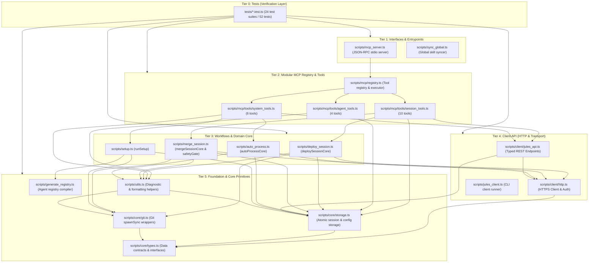

# Peta Arsitektur & Panduan Pengembangan Codebase Jules-Companion
> *Dokumen Arsitektur & Panduan Pemeliharaan Menggunakan **Sentrux** (Architectural Sensor & Governance) dan **Graft** (Semantic Context Graph)*  
> *Status Terkini: Arsitektur Modular Berorientasi Domain (52 Unit Tests 100% Passed, 0 Sentrux Violations)*

---

## 1. Ringkasan Eksekutif & Health Scorecard

Codebase `Jules-Companion` dibangun dengan **arsitektur modular berlapis berbasis domain** (*clean domain-driven layered architecture*). Kode dirancang agar memiliki pemisahan tanggung jawab (*separation of concerns*) yang jelas, tidak memiliki file monolitik (*god-files*), mengeliminasi mutasi state global (`process.argv`), dan membedakan antara antarmuka CLI dengan fungsi komputasi inti (*programmatic core functions*).

### Scorecard Kualitas Arsitektur
| Metrik Arsitektur | Nilai / Status | Analisis & Jaminan Kualitas |
| :--- | :---: | :--- |
| **Acyclicity** | 🟢 Sempurna (`10000`) | **0 siklus impor melingkar** (*zero circular dependencies*). Terkunci dan diverifikasi oleh `.sentrux/rules.toml`. |
| **Redundancy** | 🟢 Sempurna (`10000`) | Tidak ada duplikasi struktural. Logika bersama terpusat di `scripts/core/` dan `scripts/client/`. |
| **Layering & Boundaries** | 🟢 Sempurna (0 Violations) | 6 Tier arsitektur terkontrol ketat via Sentrux (`tests` ➔ `interfaces` ➔ `mcp_modules` ➔ `workflows` ➔ `client` ➔ `foundation`). |
| **Clean Interfaces** | 🟢 Programmatic Core | Fungsi inti (`deploySessionCore`, `mergeSessionCore`, `autoProcessCore`) dapat dipanggil secara modular tanpa mutasi `process.argv` dan tanpa pembajakan `stdout`. |
| **Equality & God-Files** | 🟢 Sangat Ringan | [`mcp_server.ts`](file:///e:/Data%20Utama/Coding/Antigravity/Jules-Companion/scripts/mcp_server.ts) hanya **85 baris**, [`jules_client.ts`](file:///e:/Data%20Utama/Coding/Antigravity/Jules-Companion/scripts/jules_client.ts) **185 baris**, terbagi ke tool handlers terisolasi. |
| **Modularity & Coupling** | 🟢 Terdistribusi Bersih | Beban dependensi simbol tumpuan (*hotspot callers*) terdistribusi secara seimbang ke modul `core/`, `client/`, dan `mcp/`. |
| **Test Suite Pass Rate** | 🟢 100% (52/52 Tests) | 24 test suites lulus 100% dalam ~2.5 detik pada pipeline Node.js test runner bawaan. |

---

## 2. Aliran Lapisan Arsitektur (Layering Hierarchy)

Sentrux menegakkan aturan bahwa ketergantungan kode hanya boleh mengalir **satu arah ke bawah**. Modul level bawah tidak pernah mengimpor modul level atas:



---

## 3. Pola Pemisahan Antarmuka: Programmatic Core Pattern

Salah satu peningkatan arsitektur terpenting untuk kemudahan pemeliharaan (*maintainability*) adalah adopsi **Programmatic Core Pattern**:

```
[CLI Terminal Input] ──> parseArgs() ──> [CLI Wrapper Function] ──> process.exit(code)
                                                 │
                                                 ▼
[AI Agent / IDE MCP] ──> Zod Validate ─> [Core Programmatic Function] ──> Typed Result Object
                                         (deploySessionCore /
                                          mergeSessionCore /
                                          autoProcessCore)
```

### Mengapa Pola Ini Penting?
1. **Zero Side-Effects pada MCP Server**:  
   Dahulu, pemanggilan CLI lewat MCP dilakukan dengan memutasi array global `process.argv` dan mengalihkan `process.stdout`. Jika terjadi kesalahan (`process.exit(1)`), seluruh proses server MCP akan mati mendadak.
2. **Kini Sepenuhnya Terisolasi**:  
   Fungsi inti (`*Core`) menerima parameter objek terstruktur (`DeploySessionOptions`, `MergeSessionOptions`, `AutoProcessOptions`), tidak pernah memanggil `process.exit()`, dan mengembalikan objek terstruktur berstatus `{ success, output, error? }`.
3. **CLI Menjadi Pembungkus Tipis (*Thin Wrapper*)**:  
   Fungsi CLI (`deploySession`, `mergeSession`, `autoProcess`) hanya bertugas mem-parsing `process.argv`, meneruskannya ke fungsi `*Core`, menampilkan output ke terminal, dan mengatur exit code (0 untuk sukses, 1 untuk gagal).

---

## 4. Topologi Graf Kode (Graft Wiring Graph)

Indeks graf semantik **Graft** memetakan seluruh relasi fungsi, berkas, dan interface:
- **Total Berkas Terindeks**: 35 berkas (TypeScript & Python evals)
- **Total Simbol (Nodes)**: 110 nodes (55 functions, 35 files, 19 interfaces, 1 type)
- **Total Relasi Dependensi (Edges)**: 342 edges

### Simbol Hotspot & Fungsi Fondasi:
| Simbol / Fungsi | Berkas Sumber | Jumlah Pemanggil | Peran Utama |
| :--- | :--- | :---: | :--- |
| `runGit` | [`scripts/core/git.ts`](file:///e:/Data%20Utama/Coding/Antigravity/Jules-Companion/scripts/core/git.ts) | 12 | Eksekusi aman perintah Git lokal dengan isolasi argumen |
| `loadSessions` | [`scripts/core/storage.ts`](file:///e:/Data%20Utama/Coding/Antigravity/Jules-Companion/scripts/core/storage.ts) | 8 | Pemuatan state sesi dari `.jules-companion/sessions.json` |
| `saveSessions` | [`scripts/core/storage.ts`](file:///e:/Data%20Utama/Coding/Antigravity/Jules-Companion/scripts/core/storage.ts) | 5 | Penyimpanan atomik state sesi dengan berkas temp swap |
| `getProjectDirs` | [`scripts/core/storage.ts`](file:///e:/Data%20Utama/Coding/Antigravity/Jules-Companion/scripts/core/storage.ts) | 7 | Resolusi direktori terpusat dengan in-memory cache |
| `request` | [`scripts/client/http.ts`](file:///e:/Data%20Utama/Coding/Antigravity/Jules-Companion/scripts/client/http.ts) | 6 | Komunikasi HTTPS terautentikasi ke Google REST API |
| `getApiKey` | [`scripts/client/http.ts`](file:///e:/Data%20Utama/Coding/Antigravity/Jules-Companion/scripts/client/http.ts) | 5 | Resolusi kredensial `JULES_API_KEY` dari env/.env |
| `deploySessionCore` | [`scripts/deploy_session.ts`](file:///e:/Data%20Utama/Coding/Antigravity/Jules-Companion/scripts/deploy_session.ts) | 3 | Mesin orkestrasi pendeployan sesi tunggal/tim agen |
| `mergeSessionCore` | [`scripts/merge_session.ts`](file:///e:/Data%20Utama/Coding/Antigravity/Jules-Companion/scripts/merge_session.ts) | 2 | Mesin inspeksi dua tahap & penggabungan patch aman |

---

## 5. Tata Kelola Arsitektur Aktif (`.sentrux/rules.toml`)

Konfigurasi pembatas arsitektur Sentrux mencegah terjadinya regresi struktural secara otomatis:

```toml
[constraints]
max_cycles = 0

[[layers]]
name = "tests"
paths = ["tests/*"]
order = 0

[[layers]]
name = "interfaces"
paths = [
  "scripts/mcp_server.ts",
  "scripts/sync_global.ts"
]
order = 1

[[layers]]
name = "mcp_modules"
paths = [
  "scripts/mcp/*",
  "scripts/mcp/tools/*"
]
order = 2

[[layers]]
name = "workflows"
paths = [
  "scripts/deploy_session.ts",
  "scripts/merge_session.ts",
  "scripts/auto_process.ts",
  "scripts/setup.ts"
]
order = 3

[[layers]]
name = "client"
paths = [
  "scripts/client/*",
  "scripts/jules_client.ts"
]
order = 4

[[layers]]
name = "foundation"
paths = [
  "scripts/core/*",
  "scripts/utils.ts",
  "scripts/generate_registry.ts"
]
order = 5
```

Hasil verifikasi: **`✓ All rules pass (0 violations, Quality: 6271)`**.

---

## 6. Panduan Pemeliharaan & Pengembangan (Developer Extension Guide)

Bagian ini adalah petunjuk langkah-demi-langkah bagi pengembang yang ingin memperluas kemampuan aplikasi:

### A. Menambahkan Agen Spesialisasi Baru
1. Buat berkas panduan agen di `references/agents/<nama_agen>.md`.
2. Format berkas harus diawali dengan prompt sistem yang mendefinisikan persona, aturan perilaku, dan batasan:
   ```markdown
   You are "<NamaAgen>" 🚀 - a [Deskripsi Peran Singkat] agent who [tugas spesifik].
   
   CRITICAL BEHAVIORAL DIRECTIVES:
   1. [Aturan 1]
   2. [Aturan 2]
   ```
3. Kompilasi ulang `registry.json` dengan menjalankan perintah:
   ```bash
   npm run registry
   ```
4. Jalankan pengujian untuk memverifikasi keselarasan 100%:
   ```bash
   npm test
   ```
   *(Auditor otomatis `tests/doc_coverage.test.ts` akan memastikan template markdown dan entri registry selaras).*

### B. Menambahkan Tool MCP Baru
1. Tentukan kategori tool:
   - Sesi & Lifecycle ➔ Tambahkan ke [`scripts/mcp/tools/session_tools.ts`](file:///e:/Data%20Utama/Coding/Antigravity/Jules-Companion/scripts/mcp/tools/session_tools.ts)
   - Informasi Agen & Template ➔ Tambahkan ke [`scripts/mcp/tools/agent_tools.ts`](file:///e:/Data%20Utama/Coding/Antigravity/Jules-Companion/scripts/mcp/tools/agent_tools.ts)
   - Diagnostik Sistem & Utilitas ➔ Tambahkan ke [`scripts/mcp/tools/system_tools.ts`](file:///e:/Data%20Utama/Coding/Antigravity/Jules-Companion/scripts/mcp/tools/system_tools.ts)
2. Definisikan skema validasi menggunakan **Zod**:
   ```typescript
   const NewActionSchema = z.object({
     targetDir: z.string().optional(),
     flag: z.boolean().optional()
   });
   ```
3. Tambahkan objek definisi tool ke array yang diekspor:
   ```typescript
   {
     name: 'new_action_name',
     description: 'Deskripsi fungsionalitas tool untuk LLM.',
     inputSchema: {
       type: 'object',
       properties: {
         targetDir: { type: 'string', description: 'Direktori target' }
       }
     },
     execute: async (args: any) => {
       const parsed = NewActionSchema.safeParse(args);
       if (!parsed.success) {
         return { content: [{ type: 'text', text: `Validation Error: ${parsed.error.message}` }] };
       }
       // Panggil fungsi core logic langsung
       return { content: [{ type: 'text', text: 'Hasil eksekusi' }] };
     }
   }
   ```
4. Verifikasi dengan menjalankan tes registry MCP:
   ```bash
   npx tsx --test tests/unit_mcp_registry.test.ts
   ```

### C. Menambahkan Endpoint REST Jules Baru
1. Buka [`scripts/client/jules_api.ts`](file:///e:/Data%20Utama/Coding/Antigravity/Jules-Companion/scripts/client/jules_api.ts).
2. Tambahkan wrapper fungsi bertipe yang memanfaatkan utilitas `request` dan `getApiKey`:
   ```typescript
   export async function newEndpointApi(param: string, targetDir?: string): Promise<any> {
     const apiKey = getApiKey(targetDir);
     if (!apiKey) throw new Error('JULES_API_KEY not found in environment or .env file.');
     const headers = { 'X-Goog-Api-Key': apiKey };
     return await request(`https://jules.googleapis.com/v1alpha/${param}`, {
       method: 'GET',
       headers
     });
   }
   ```
3. Ekspor fungsi tersebut dan sertakan blok TSDoc lengkap (`@param`, `@returns`, `@throws`).

### D. Memahami Alur Dua Tahap Git Safety Gate (`merge_session.ts`)
Setiap proses penggabungan perubahan kode dari cloud dilindungi oleh pengaman ketat:
1. **Pre-flight Stash**:  
   Jika direktori kerja memiliki perubahan lokal yang belum di-commit (*dirty worktree*), sistem secara otomatis melakukan `git stash push -u -m "jules-merge-backup-<timestamp>"` agar pekerjaan lokal pengembang tidak hilang tertimpa.
2. **Safety Gate Check (`checkSafetyGate`)**:  
   Memeriksa apakah masih ada sesi agen cloud lain yang sedang aktif mengubah kode. Jika ada sesi yang belum `COMPLETED`, penggabungan ditolak demi mencegah konflik antarsesi.
3. **Stage 1: Inspeksi Terisolasi (`--inspect`)**:  
   Patch unidiff dari Jules diunduh dan diterapkan ke branch terpisah bernama `jules/review-<sessionId>`. Laporan ulasan Markdown otomatis dihasilkan di `docs/jules-reviews/` tanpa menyentuh branch utama pengembang.
4. **Stage 2: Persetujuan Penggabungan (`--approve`)**:  
   Setelah pengembang memeriksa branch review dan menyetujui, perubahan di-merge ke branch target (misal `main`).
5. **Recovery Stash Pop**:  
   Pada blok `finally`, uncommitted WIP yang di-stash pada langkah pertama dikembalikan secara otomatis (`git stash pop`).

---

## 7. Cheatsheet Perintah Pengembangan & Verifikasi

| Kebutuhan Workflow | Perintah | Deskripsi & Dampak |
| :--- | :--- | :--- |
| **Pipeline Verifikasi Lengkap** | `npm run verify` | Menjalankan seluruh pengujian unit (`npm test`) + validasi Sentrux + validasi Graf. |
| **Test Suite Cepat** | `npm test` | Menjalankan `pretest` (esbuild), `postbuild` (sync), dan 52 unit tests via `tsx --test`. |
| **Audit Arsitektur Layering** | `npm run sentrux:check` | Memvalidasi kepatuhan 6-tier arsitektur Sentrux (0 violations). |
| **Visualisasi Graf Semantik** | `npm run graft:viz` | Membuka server navigasi visual graf arsitektur 2D/3D di browser (`localhost:4400`). |
| **Ekspor Graf Mandiri (HTML)** | `npm run graft:export` | Memperbarui berkas visual mandiri di [`docs/architecture-graph/index.html`](file:///e:/Data%20Utama/Coding/Antigravity/Jules-Companion/docs/architecture-graph/index.html). |
| **Cek Blast Radius Git Diff** | `npm run graft:blast` | Menganalisis simbol/komponen apa saja yang terdampak oleh perubahan commit terakhir. |
| **Sinkronisasi Global IDE** | `npm run sync` | Menyalin seluruh `dist/*.js`, template agen, dan dokumentasi ke `~/.gemini/config/skills/jules-companion`. |
| **Kompilasi Ulang Registry Agen** | `npm run registry` | Membaca ulang seluruh markdown di `references/agents/*.md` dan memperbarui `registry.json`. |
| **Audit Standar TSDoc** | `npx tsx --test tests/doc_coverage.test.ts` | Memastikan 100% simbol yang diekspor di `scripts/` memiliki blok TSDoc ber-tag `@param` dan `@returns`. |
