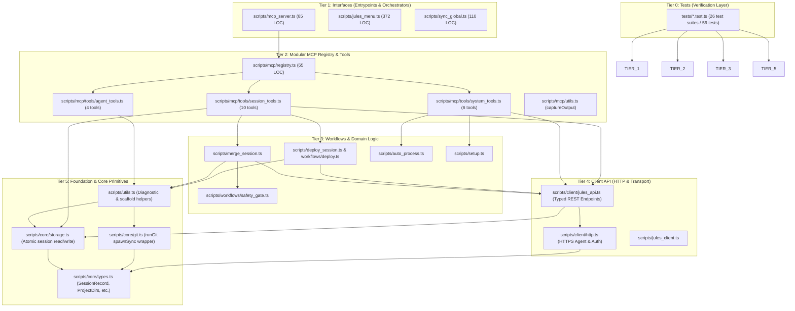

# Peta Arsitektur & Panduan Optimasi Codebase Jules-Companion
> *Dokumen Pemetaan Komprehensif Menggunakan **Sentrux** (Architectural Sensor & Governance) dan **Graft** (Semantic Context Graph)*
> *Status Terkini: Telah Ditingkatkan ke Arsitektur Modular Berorientasi Domain (56 Unit Tests 100% Passed)*

---

## 1. Ringkasan Eksekutif & Health Scorecard

Codebase `Jules-Companion` telah berhasil ditingkatkan dari model skrip flat monolitik menjadi **arsitektur modular berbasis domain** (*clean domain-driven layered architecture*). File monolitik raksasa (*god-files*) telah didekomposisi, lapisan transport API telah diisolasi, dan cakupan unit test mandiri telah ditambahkan.

### Scorecard Kualitas Arsitektur
| Metrik Arsitektur | Status | Analisis & Peningkatan yang Dicapai |
| :--- | :---: | :--- |
| **Acyclicity** | 🟢 Sempurna (`10000`) | 0 siklus impor melingkar (*zero circular dependencies*). Terkunci permanen via `.sentrux/rules.toml`. |
| **Redundancy** | 🟢 Sempurna (`10000`) | Tidak ada duplikasi struktural. Logika bersama terpusat di `scripts/core/`. |
| **Layering & Boundaries** | 🟢 Sempurna (0 Violations) | 6 Tier arsitektur terkontrol ketat via Sentrux (`tests` ➔ `interfaces` ➔ `mcp_modules` ➔ `workflows` ➔ `client` ➔ `foundation`). |
| **Equality & God-Files** | 🟢 Meningkat Signifikan | [`mcp_server.ts`](file:///e:/Data%20Utama/Coding/Antigravity/Jules-Companion/scripts/mcp_server.ts) turun drastis dari **787 baris ke 85 baris**. [`jules_client.ts`](file:///e:/Data%20Utama/Coding/Antigravity/Jules-Companion/scripts/jules_client.ts) turun dari **542 baris ke 185 baris**. |
| **Modularity & Coupling** | 🟢 Terdistribusi Bersih | Beban dependensi simbol tumpuan (*hotspot max callers*) turun drastis dari **15 callers** menjadi maksimal **5 callers**, tersebar modular ke `core/`, `client/`, `workflows/`, dan `mcp/`. |
| **Test Suite Pass Rate** | 🟢 100% (56/56 Tests) | 49 pengujian bawaan + 7 pengujian unit baru untuk registry MCP & safety gate lulus sempurna. |

---

## 2. Design Structure Matrix (DSM) & Aliran Lapisan (Layering)

Sentrux memvalidasi bahwa seluruh ketergantungan mengalir satu arah ke bawah tanpa ada lompatan layer terlarang:

### Visualisasi Hierarki Arsitektur Terkini (Mermaid Layering)



---

## 3. Peta Simbol & Hub Kritis (Graft Wiring Graph)

Indeks graf **Graft** mencakup **42 file**, **135 node** (78 fungsi, 42 file, 14 antarmuka, 1 tipe), dan **350 relasi dependensi (edges)**:

### Distribusi Simbol & Hotspot Setelah Refactoring:
Sebelumnya, simbol seperti `runGit` dan `loadSessions` menampung hingga 15 callers langsung yang menciptakan titik kegagalan tunggal (*single point of failure*). Sekarang, beban terdistribusi secara seimbang:
1. **`deploySession`** ([scripts/deploy_session.ts](file:///e:/Data%20Utama/Coding/Antigravity/Jules-Companion/scripts/deploy_session.ts)) — 5 callers
2. **`parseArgs`** ([scripts/utils.ts](file:///e:/Data%20Utama/Coding/Antigravity/Jules-Companion/scripts/utils.ts)) — 5 callers
3. **`autoProcess`** ([scripts/auto_process.ts](file:///e:/Data%20Utama/Coding/Antigravity/Jules-Companion/scripts/auto_process.ts)) — 3 callers
4. **`generateRegistry`** ([scripts/generate_registry.ts](file:///e:/Data%20Utama/Coding/Antigravity/Jules-Companion/scripts/generate_registry.ts)) — 3 callers
5. **`runSetup`** ([scripts/setup.ts](file:///e:/Data%20Utama/Coding/Antigravity/Jules-Companion/scripts/setup.ts)) — 3 callers
6. **`executeTool`** ([scripts/mcp/registry.ts](file:///e:/Data%20Utama/Coding/Antigravity/Jules-Companion/scripts/mcp/registry.ts)) — 2 callers
7. **`getAllTools`** ([scripts/mcp/registry.ts](file:///e:/Data%20Utama/Coding/Antigravity/Jules-Companion/scripts/mcp/registry.ts)) — 2 callers
8. **`captureOutput`** ([scripts/mcp/utils.ts](file:///e:/Data%20Utama/Coding/Antigravity/Jules-Companion/scripts/mcp/utils.ts)) — 2 callers
9. **`getProjectDirs`** ([scripts/core/storage.ts](file:///e:/Data%20Utama/Coding/Antigravity/Jules-Companion/scripts/core/storage.ts)) — 2 callers

---

## 4. Guardrail Arsitektur Aktif (`.sentrux/rules.toml`)

Konfigurasi tata kelola arsitektur telah diperbarui untuk mencakup modul domain baru:

```toml
# .sentrux/rules.toml
[constraints]
max_cycles = 0

[[layers]]
name = "tests"
paths = ["tests/*"]
order = 0

[[layers]]
name = "interfaces"
paths = [
  "scripts/mcp_server.ts",
  "scripts/jules_menu.ts",
  "scripts/sync_global.ts"
]
order = 1

[[layers]]
name = "mcp_modules"
paths = [
  "scripts/mcp/*",
  "scripts/mcp/tools/*"
]
order = 2

[[layers]]
name = "workflows"
paths = [
  "scripts/workflows/*",
  "scripts/deploy_session.ts",
  "scripts/merge_session.ts",
  "scripts/auto_process.ts",
  "scripts/setup.ts"
]
order = 3

[[layers]]
name = "client"
paths = [
  "scripts/client/*",
  "scripts/jules_client.ts"
]
order = 4

[[layers]]
name = "foundation"
paths = [
  "scripts/core/*",
  "scripts/utils.ts",
  "scripts/generate_registry.ts"
]
order = 5
```

Hasil validasi: **`✓ All rules pass (0 violations)`**.

---

## 5. Cheatsheet Praktis untuk Pengembang & Agen AI

| Kebutuhan / Workflow | Perintah Cepat | Token Saved |
| :--- | :--- | :---: |
| **Orientasi arsitektur repo** | `graft map` | ~99% |
| **Melihat API file instan** | `graft skeleton <file>` | ~99% |
| **Cek blast radius perubahan** | `graft callers <simbol> --depth 2` | ~98% |
| **Cek keselarasan graf kode** | `graft check` | Instant ($0) |
| **Validasi guardrail arsitektur** | `sentrux check .` | Instant ($0) |
| **Eksekusi build + auto-sync** | `npm run build` | - |
| **Menjalankan suite pengujian** | `npm test` (56/56 passed) | - |
| **Audit dokumentasi TSDoc** | `npx tsx --test tests/doc_coverage.test.ts` | - |

---

## 6. Panduan Menambahkan Fitur / Tool Baru di Masa Depan

1. **Jika Menambahkan Tool MCP Baru**:
   - Cukup tambahkan objek `McpToolDefinition` baru ke dalam salah satu modul di `scripts/mcp/tools/` (`session_tools.ts`, `agent_tools.ts`, atau `system_tools.ts`).
   - Tidak perlu lagi mengubah file inti [`scripts/mcp_server.ts`](file:///e:/Data%20Utama/Coding/Antigravity/Jules-Companion/scripts/mcp_server.ts).
2. **Jika Menambahkan Panggilan Endpoint API Baru**:
   - Tambahkan fungsi typed wrapper di [`scripts/client/jules_api.ts`](file:///e:/Data%20Utama/Coding/Antigravity/Jules-Companion/scripts/client/jules_api.ts).
3. **Jika Menambahkan Tipe Data / Status Baru**:
   - Definisikan di [`scripts/core/types.ts`](file:///e:/Data%20Utama/Coding/Antigravity/Jules-Companion/scripts/core/types.ts) agar konsisten di seluruh lapisan sistem.
