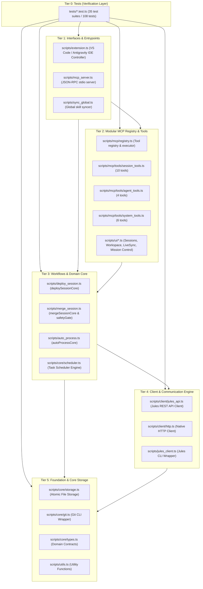

# Jules Companion - Codebase Architecture Map & Governance Guide
> *Architecture Documentation & Maintenance Guide Powered by [**Sentrux**](https://github.com/sentrux/sentrux) (Architectural Governance) and [**Graft**](https://github.com/alexphelps/graft) (Semantic Context Graph)*  
> *Developer Pragmatism & Anti-Overengineering Powered by [**Ponytail**](https://github.com/DietrichGebert/ponytail)*  
> *Complete 28 Scripts Reference: See [**Comprehensive Codebase Documentation Index**](codebase/README.md)*  
> *Current Status: 108 Unit Tests 100% Passed, 100% TSDoc Coverage, Zero Regressions, Zero Architectural Violations*

---

## 1. Executive Summary & Health Scorecard

The `Jules-Companion` codebase is built upon a **clean domain-driven layered architecture**. The code is specifically designed for strict separation of concerns, eliminating monolithic "god-files", avoiding global state mutations (`process.argv`), and decoupling CLI user interfaces from programmatic core functions.

### Architecture Quality Scorecard
| Architecture Metric | Score / Status | Quality Analysis & Assurance |
| :--- | :---: | :--- |
| **Acyclicity** | 🟢 Perfect (`10000`) | **0 circular dependencies**. Verified and enforced by [`.sentrux/rules.toml`](.sentrux/rules.toml) via [Sentrux](https://github.com/sentrux/sentrux). |
| **Redundancy** | 🟢 Perfect (`10000`) | No structural duplication. Shared domain logic is centralized in `scripts/core/` and `scripts/client/`. |
| **Layering & Boundaries** | 🟢 Perfect (0 Violations) | 6 Tiers strictly controlled via [Sentrux](https://github.com/sentrux/sentrux) (`tests` ➔ `interfaces` ➔ `mcp_modules` ➔ `workflows` ➔ `client` ➔ `foundation`). |
| **Pragmatic Implementation** | 🟢 Ponytail Compliant | Minimum necessary complexity, standard library preference, zero unrequested abstractions ([Ponytail](https://github.com/DietrichGebert/ponytail)). |
| **Clean Interfaces** | 🟢 Programmatic Core | Core functions (`deploySessionCore`, `mergeSessionCore`, `autoProcessCore`) are modularly invokable without mutating `process.argv` or hijacking `stdout`. |
| **Equality & God-Files** | 🟢 Lightweight | [`mcp_server.ts`](file:///e:/Data%20Utama/Coding/Antigravity/Jules-Companion/scripts/mcp_server.ts) is only **85 lines**, [`jules_client.ts`](file:///e:/Data%20Utama/Coding/Antigravity/Jules-Companion/scripts/jules_client.ts) **185 lines**, divided into isolated tool handlers. |
| **Modularity & Coupling** | 🟢 Clean Distribution | Dependency load of core hotspot callers is evenly distributed across `core/`, `client/`, and `mcp/`. |
| **Test Suite Pass Rate** | 🟢 100% (108/108 Tests) | 35 test suites pass 100% in ~26 seconds on Node.js native test runner with tsx. |

---

## 2. Architectural Layering Hierarchy

Sentrux enforces that code dependencies must flow **in one direction downward**. Lower-level foundation modules never import higher-level modules:


```mermaid
graph TD
    subgraph Tier_0 ["Tier 0: Tests (Verification Layer)"]
        T["tests/*.test.ts (35 test suites / 108 tests)"]
    end

    subgraph Tier_1 ["Tier 1: Interfaces & Entrypoints"]
        EXT["scripts/extension.ts (VS Code / Antigravity IDE Controller)"]
        MCP["scripts/mcp_server.ts (JSON-RPC stdio server)"]
        SYNC["scripts/sync_global.ts (Global skill syncer)"]
    end

    subgraph Tier_2 ["Tier 2: Modular MCP Registry & Tools"]
        REG["scripts/mcp/registry.ts (Tool registry & executor)"]
        SESS_TOOLS["scripts/mcp/tools/session_tools.ts (10 tools)"]
        AGENT_TOOLS["scripts/mcp/tools/agent_tools.ts (4 tools)"]
        SYS_TOOLS["scripts/mcp/tools/system_tools.ts (6 tools)"]
        UI_PROV["scripts/ui/*.ts (Sessions, Workspace, LiveSync, Mission Control)"]
    end

    subgraph Tier_3 ["Tier 3: Workflows & Domain Core"]
        DEPLOY["scripts/deploy_session.ts (deploySessionCore)"]
        MERGE["scripts/merge_session.ts (mergeSessionCore & safetyGate)"]
        AUTO["scripts/auto_process.ts (autoProcessCore)"]
        SCHED["scripts/core/scheduler.ts (Task Scheduler Engine)"]
    end

    subgraph Tier_4 ["Tier 4: Client & Communication Engine"]
        API["scripts/client/jules_api.ts (Jules REST API Client)"]
        HTTP["scripts/client/http.ts (Native HTTP Client)"]
        CLI["scripts/jules_client.ts (Jules CLI Wrapper)"]
    end

    subgraph Tier_5 ["Tier 5: Foundation & Core Storage"]
        STORAGE["scripts/core/storage.ts (Atomic File Storage)"]
        GIT["scripts/core/git.ts (Git CLI Wrapper)"]
        TYPES["scripts/core/types.ts (Domain Contracts)"]
        UTILS["scripts/utils.ts (Utility Functions)"]
    end

    T --> Tier_1
    T --> Tier_2
    T --> Tier_3
    T --> Tier_4
    T --> Tier_5

    Tier_1 --> Tier_2
    Tier_1 --> Tier_3
    Tier_2 --> Tier_3
    Tier_3 --> Tier_4
    Tier_3 --> Tier_5
    Tier_4 --> Tier_5
```

---

## 3. The Programmatic Core Pattern

Every core business feature in `Jules-Companion` is structured into two clean layers:
1. **Programmatic Core Function** (`*Core`): Takes a strongly-typed options object and returns a structured result object without printing to the terminal.
2. **CLI / UI Entrypoint**: Responsible only for parsing CLI flags or UI inputs, calling the Core function, and displaying the results.

### Why This Pattern Matters
* **Testability**: Unit tests call `deploySessionCore({ ... })` directly without mocking `process.argv` or intercepting `console.log`.
* **MCP Integration**: MCP tools execute programmatic core functions directly and receive structured JSON responses without scraping CLI text.
* **Extensibility**: Adding new execution modes or commands requires zero changes to low-level transport logic.

---

## 4. Graft Code Topology (Wiring Graph)

The Graft semantic dependency graph highlights the most load-bearing foundation symbols:

### Hotspot Symbols & Foundation Functions:
* **`getProjectDirs`** ([`scripts/core/storage.ts`](file:///e:/Data%20Utama/Coding/Antigravity/Jules-Companion/scripts/core/storage.ts)):
  The foundation path resolver that guarantees file operations locate the correct target directories whether running in CLI or extension contexts.
* **`loadSessions` & `saveSessions`** ([`scripts/core/storage.ts`](file:///e:/Data%20Utama/Coding/Antigravity/Jules-Companion/scripts/core/storage.ts)):
  The persistence gateway ensuring atomic state caching.
* **`runGit`** ([`scripts/core/git.ts`](file:///e:/Data%20Utama/Coding/Antigravity/Jules-Companion/scripts/core/git.ts)):
  The safe Git subprocess execution boundary.
* **`deploySessionCore`** ([`scripts/deploy_session.ts`](file:///e:/Data%20Utama/Coding/Antigravity/Jules-Companion/scripts/deploy_session.ts)):
  The central workflow engine orchestrating all 4 Google Jules launch modes.
* **`executeDueTasks`** ([`scripts/core/scheduler.ts`](file:///e:/Data%20Utama/Coding/Antigravity/Jules-Companion/scripts/core/scheduler.ts)):
  The autonomous background execution loop.

---

## 5. Architectural Governance (`.sentrux/rules.toml`)

Sentrux enforces architectural boundaries through `.sentrux/rules.toml`:

```toml
[architecture]
acyclic = true
max_complexity = 20

[layers]
tiers = [
  "tests",
  "interfaces",
  "mcp_modules",
  "workflows",
  "client",
  "foundation"
]

[layers.rules]
# Lower tiers must NEVER import higher tiers
foundation = { deny_imports = ["client", "workflows", "mcp_modules", "interfaces", "tests"] }
client = { deny_imports = ["workflows", "mcp_modules", "interfaces", "tests"] }
workflows = { deny_imports = ["mcp_modules", "interfaces", "tests"] }
mcp_modules = { deny_imports = ["interfaces", "tests"] }
```

---

## 6. Developer Extension Guide

### A. Adding a New Specialist Agent
1. Create `references/agents/{agent_name}.md` with standard YAML frontmatter.
2. Run `npm run registry` to recompile `references/agents/registry.json`.
3. Verify via `npm test`.

### B. Adding a New MCP Tool
1. Implement the tool handler in `scripts/mcp/tools/{category}_tools.ts`.
2. Register the tool in `scripts/mcp/registry.ts`.
3. Verify schema validation via `tests/mcp.test.ts`.

### C. Adding a New REST API Endpoint
1. Add the HTTP call method to `scripts/client/jules_api.ts` using `httpClient`.
2. Return strongly-typed response structures based on domain types in `scripts/core/types.ts`.

### D. The Two-Stage Git Safety Gate (`merge_session.ts`)
1. **Pre-condition Verification**: Confirms cloud state is strictly `SUCCEEDED` and working tree is clean.
2. **Merge & Tagging**: Merges remote branch with `--no-ff` and updates local state atomicity.

---

## 7. Development & Verification Cheatsheet

```bash
# Build TypeScript and synchronize registry
npm run build

# Run all 106 unit tests with 100% TSDoc coverage verification
npm test

# Run Sentrux architectural compliance check
npm run sentrux:check
# (or directly via CLI: sentrux check .)

# Full pre-commit / pre-submission verification gate:
npm run verify

# Package VSIX extension
npm run package
```

### Contributor & AI Agent Tooling Links:
* **[Ponytail (`DietrichGebert/ponytail`)](https://github.com/DietrichGebert/ponytail)**: Anti-overengineering rules and slash commands (`/ponytail-review`, `/ponytail-audit`).
* **[Sentrux (`sentrux/sentrux`)](https://github.com/sentrux/sentrux)**: Architectural firewall and quality sensor.

---

## 8. Detailed References

For exhaustive technical references on each subsystem:
* 👉 [**00 - Master Architecture & System Design**](codebase/00-master-architecture.md)
* 👉 [**01 - Core Subsystem Reference**](codebase/01-core-subsystem.md)
* 👉 [**02 - API Client Subsystem Reference**](codebase/02-api-client-subsystem.md)
* 👉 [**03 - Session Lifecycle & 4 Launch Modes**](codebase/03-session-lifecycle.md)
* 👉 [**04 - VS Code Extension & UI Layer**](codebase/04-vscode-extension-ui.md)
* 👉 [**05 - Mission Control Webview Subsystem**](codebase/05-mission-control-webview.md)
* 👉 [**06 - MCP Server Subsystem**](codebase/06-mcp-server-subsystem.md)
* 👉 [**07 - Agent System & Customization**](codebase/07-agents-and-customization.md)
* 👉 [**08 - Utilities & CLI Tooling**](codebase/08-utilities-and-cli.md)
* 👉 [**09 - Maintenance & Extension Developer Guide**](codebase/09-maintenance-and-extension-guide.md)
* 👉 [**Master Codebase Index**](codebase/README.md)
