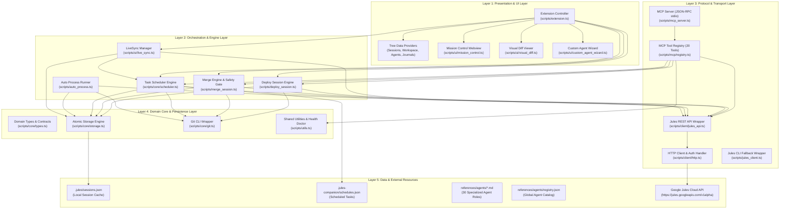
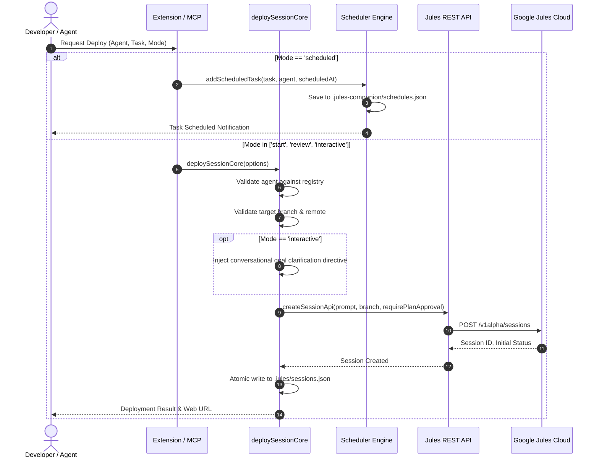
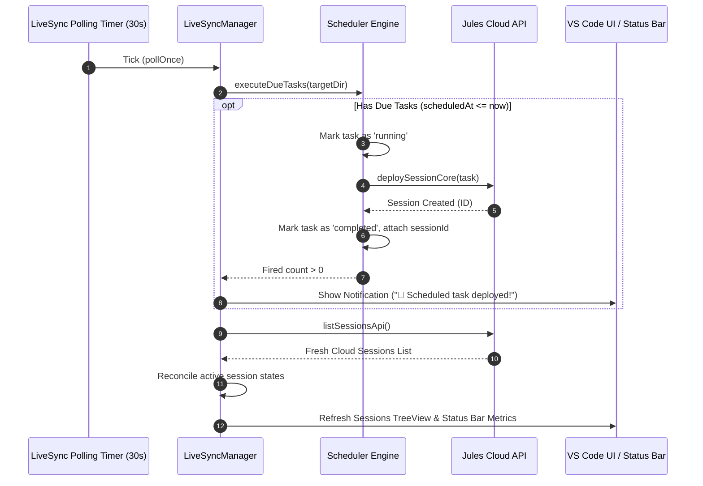
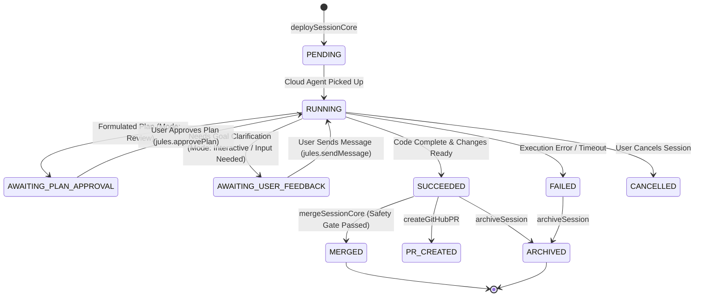

# 00 - Master Architecture & System Design
**Jules Companion: Enterprise AI Agent Extension & Orchestration Platform**

---

## 1. Overview & Architectural Goals

**Jules Companion** is an AI agent orchestration platform and native IDE extension (fully compatible with Visual Studio Code and Google Antigravity IDE) that bridges local developer environments with the cloud-native Google Jules autonomous coding service.

The primary architectural goals of Jules Companion are:
1. **Multi-Modal Execution**: Full support for all 4 official Google Jules launch modes (`start`, `review`, `interactive`, `scheduled`).
2. **Autonomous Background Scheduling**: Standalone local task scheduler that evaluates due tasks and autonomously deploys them without manual developer intervention.
3. **State Reconciliation & Safety Gate**: Transparent reconciliation between live cloud state (`ACTIVE`, `AWAITING_PLAN_APPROVAL`, `AWAITING_USER_FEEDBACK`, `SUCCEEDED`, `FAILED`) and local disk cache, protected by a fail-safe *Safety Gate* before any Git merge operations.
4. **Dual Interface Compatibility**: Operable visually via IDE TreeViews & Mission Control Webview, or programmatically by Large Language Models (LLMs) via the Model Context Protocol (MCP) using 20 native tools.
5. **Clean Separation of Concerns**: Highly modular design strictly separating UI, Core Domain, API Client, MCP Server, and Storage layers.

---

## 2. High-Level Layered Architecture

The system is organized into 5 independent yet neatly orchestrated layers:

---

## 3. Data Flow & Subsystem Interactions

### 3.1. Session Deployment Flow (4 Launch Modes)

The following sequence illustrates how a session deployment request is processed based on `LaunchMode`:

### 3.2. Background Synchronization & Scheduled Execution Loop

---

## 4. State Machine & Status Reconciliation

Jules session statuses are managed with strict, deterministic transitions:

### Core Design Rules:
1. **Status Disambiguation**: The states `AWAITING_PLAN_APPROVAL` and `AWAITING_USER_FEEDBACK` are strictly decoupled. The system never displays a plan approval form if the cloud agent is merely asking for user input or goal clarification.
2. **Cloud Live Priority**: Data returned by `getSessionApi` cloud endpoint takes precedence over local disk cache to prevent stale action triggers.

---

## 5. Security & Isolation Policies

1. **Content Security Policy (CSP) in Webview**:
   - The Mission Control Webview enforces strict CSP (`default-src 'none'; style-src 'unsafe-inline'; script-src 'nonce-...';`).
   - Inline event handlers (`onclick="..."`) are strictly prohibited. All user actions utilize semantic Event Delegation via `data-action` attributes.
2. **Credential Resolution**:
   - Google Jules API key is resolved hierarchically: VS Code configuration (`jules.apiKey`) -> Environment variable (`JULES_API_KEY` / `GEMINI_API_KEY`) -> local `.env` file -> Secure interactive prompt.
3. **Safety Gate Merge Verification**:
   - `mergeSessionCore` rejects branch merges if the session is not verified as `SUCCEEDED` on Google Jules Cloud.
4. **Atomic Disk Writes**:
   - Modifications to `.jules/sessions.json` and `.jules-companion/schedules.json` use synchronous atomic persistence to avoid race conditions across processes.

---

## 6. Architectural Governance & Quality Tooling

The integrity and simplicity of this codebase is continuously guarded by two open-source developer tools:
1. **[Sentrux](https://github.com/sentrux/sentrux)**: Automated architectural linter enforcing strict acyclic downward layering via [`.sentrux/rules.toml`](../../.sentrux/rules.toml). Validated via `npm run sentrux:check` and `sentrux check .`.
2. **[Ponytail](https://github.com/DietrichGebert/ponytail)**: Pragmatic senior developer ruleset for human contributors and AI coding assistants, enforcing YAGNI, standard library prioritization, and minimal surgical diffs. Runs via `/ponytail full` and `/ponytail-review`.
