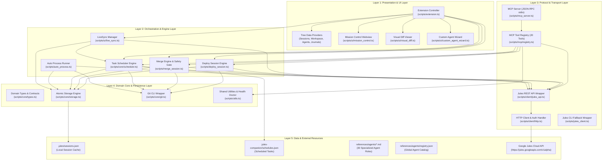
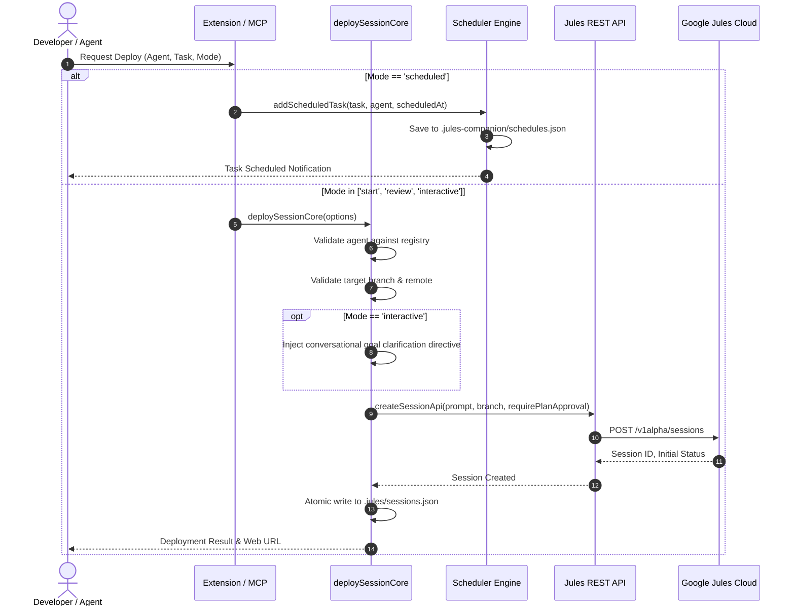
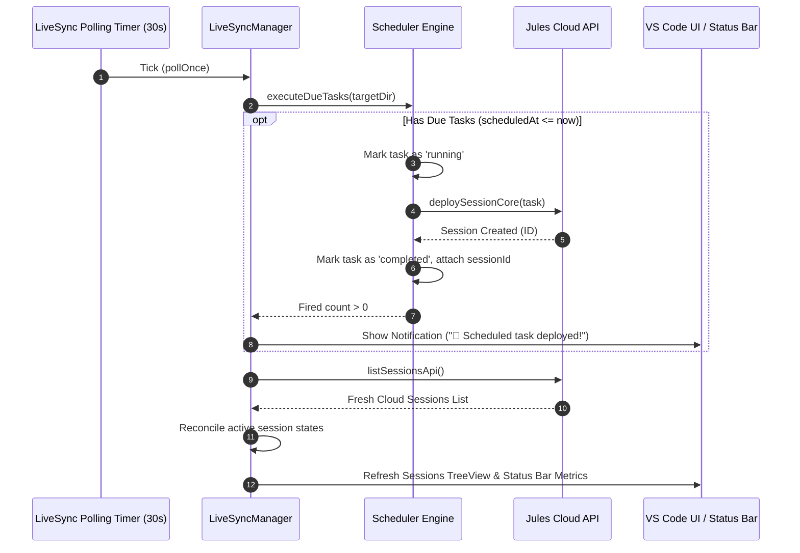
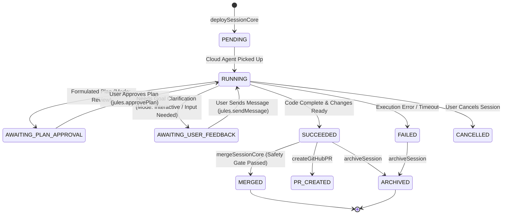

# 00 - Master Architecture & System Design
**Jules Companion: Enterprise AI Agent Extension & Orchestration Platform**

---

## 1. Overview & Architectural Goals

**Jules Companion** adalah platform orkestrasi agen AI dan ekstensi IDE (kompatibel penuh dengan Visual Studio Code dan Google Antigravity IDE) yang menghubungkan developer lokal dengan layanan cloud Google Jules.

Tujuan utama arsitektur Jules Companion meliputi:
1. **Multi-Modal Execution**: Mendukung penuh 4 mode peluncuran sesi resmi Google Jules (`start`, `review`, `interactive`, `scheduled`).
2. **Autonomous Background Scheduling**: Mesin penjadwalan lokal yang memicu eksekusi sesi otonom saat jatuh tempo tanpa intervensi manual.
3. **State Reconciliation & Safety**: Rekonsiliasi transparan antara status sesi cloud live (`ACTIVE`, `AWAITING_PLAN_APPROVAL`, `AWAITING_USER_FEEDBACK`, `SUCCEEDED`, `FAILED`) dan status lokal di disk, dilindungi *Safety Gate* sebelum operasi merge Git.
4. **Dual Interface Compatibility**: Dapat dioperasikan secara visual melalui IDE TreeView & Mission Control Webview, atau secara programatis oleh model bahasa besar (LLM) melalui protokol standar Model Context Protocol (MCP) dengan 20 native tools.
5. **Clean Separation of Concerns**: Modularitas tinggi dengan pemisahan tegas antara UI, Domain Core, API Client, MCP Server, dan Storage.

---

## 2. High-Level Layered Architecture

Sistem dirancang dalam 5 lapisan independen namun terkoordinasi secara rapi:

---

## 3. Data Flow & Subsystem Interactions

### 3.1. Session Deployment Flow (4 Launch Modes)

Diagram berikut mengilustrasikan bagaimana sebuah permintaan sesi diproses berdasarkan `LaunchMode`:

### 3.2. Background Synchronization & Scheduled Execution Loop

---

## 4. State Machine & Status Reconciliation

Status sesi Jules dikelola dengan transisi tegas:

### Prinsip Penting:
1. **Diferensiasi Status**: Status `AWAITING_PLAN_APPROVAL` dan `AWAITING_USER_FEEDBACK` dipisahkan secara tegas. Sistem tidak pernah menampilkan form persetujuan rencana jika agen hanya menanyakan klarifikasi masukan.
2. **Prioritas Cloud Live**: Data dari endpoint `getSessionApi` cloud selalu diprioritaskan di atas cache disk lokal untuk mencegah aksi usang (*stale action*).

---

## 5. Keamanan & Kebijakan Isolasi

1. **Content Security Policy (CSP) Webview**:
   - Webview Mission Control menggunakan CSP ketat (`default-src 'none'; style-src 'unsafe-inline'; script-src 'nonce-...';`).
   - Tidak ada inline event handler (`onclick="..."`). Seluruh aksi menggunakan arsitektur Event Delegation berbasis atribut `data-action`.
2. **Penyimpanan Kredensial**:
   - API Key Google Jules diresolusi dengan urutan aman: Konfigurasi VS Code (`jules.apiKey`) -> Environment Variable (`JULES_API_KEY` / `GEMINI_API_KEY`) -> `.env` file lokal -> Interactive Secure Prompt.
3. **Safety Gate Verifikasi Merge**:
   - `mergeSessionCore` menolak menggabungkan branch jika sesi belum diverifikasi tuntas di Google Jules Cloud (`status === 'SUCCEEDED'`).
4. **Penulisan Berkas Atomik**:
   - Operasi modifikasi `.jules/sessions.json` dan `.jules-companion/schedules.json` menggunakan teknik serialisasi sinkron untuk mencegah *race condition* antar proses.
