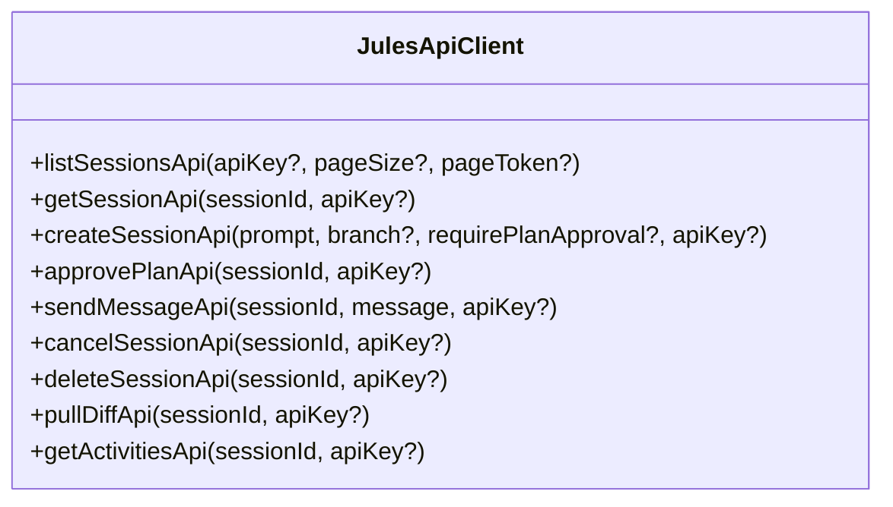

# 02 - API Client Subsystem Reference
**Modul:** [`scripts/client/http.ts`](file:///E:/Data%20Utama/Coding/Antigravity/Jules-Companion/scripts/client/http.ts), [`scripts/client/jules_api.ts`](file:///E:/Data%20Utama/Coding/Antigravity/Jules-Companion/scripts/client/jules_api.ts), [`scripts/jules_client.ts`](file:///E:/Data%20Utama/Coding/Antigravity/Jules-Companion/scripts/jules_client.ts)

---

## 1. Arsitektur Klien HTTP Native (`http.ts`)

Modul [`scripts/client/http.ts`](file:///E:/Data%20Utama/Coding/Antigravity/Jules-Companion/scripts/client/http.ts) mengimplementasikan klien HTTP berkinerja tinggi menggunakan pustaka standar Node.js (`node:https` dan `node:http`) tanpa ketergantungan pada dependensi pihak ketiga yang berat seperti `axios` atau `node-fetch`.

### 1.1. Resolusi Kredensial API Key
Fungsi `resolveApiKey(providedKey?: string): string` menyelesaikan token otentikasi Google Jules secara berjenjang:
1. Argumen `providedKey` eksplisit.
2. Variabel lingkungan `JULES_API_KEY`.
3. Variabel lingkungan alternatif `GEMINI_API_KEY`.
4. Berkas lingkungan `.env` lokal di direktori kerja aktif.
5. Konfigurasi workspace VS Code `jules.apiKey`.

### 1.2. Eksekusi Permintaan HTTP
```typescript
export interface HttpRequestOptions {
  url: string;
  method?: 'GET' | 'POST' | 'PUT' | 'DELETE' | 'PATCH';
  headers?: Record<string, string>;
  body?: any;
  apiKey?: string;
  timeoutMs?: number;
}

export interface HttpResponse<T = any> {
  statusCode: number;
  statusMessage: string;
  headers: Record<string, string | string[] | undefined>;
  data: T;
  rawBody: string;
}
```

- **Otentikasi Header**: Kunci API secara otomatis disematkan ke dalam header permintaan HTTP:
  ```http
  X-Goog-Api-Key: <resolved_api_key>
  Content-Type: application/json; charset=utf-8
  Accept: application/json
  ```
- **Penanganan Status Code**:
  - `200 - 299`: Permintaan sukses; isi respons di-parsing secara otomatis menjadi objek JavaScript jika bertipe JSON.
  - `400 - 599`: Dilempar sebagai `HttpError` yang mencakup kode status, pesan status, dan badan respons kesalahan mentah untuk mempermudah pelacakan masalah.
- **Timeout**: Standar timeout bawaan adalah `30.000 ms` (30 detik).

---

## 2. Pemetaan Google Jules REST API (`jules_api.ts`)

Modul [`scripts/client/jules_api.ts`](file:///E:/Data%20Utama/Coding/Antigravity/Jules-Companion/scripts/client/jules_api.ts) memetakan seluruh endpoint resmi Google Jules Cloud API v1alpha (`https://jules.googleapis.com/v1alpha`).

### Daftar Endpoint Lengkap:



#### 2.1. `listSessionsApi`
- **Method**: `GET /v1alpha/sessions`
- **Tujuan**: Mengambil daftar sesi cloud milik akun Google Jules terautentikasi.
- **Parameter**:
  - `apiKey?: string`: Kunci API opsional.
  - `pageSize?: number`: Jumlah sesi per halaman (default 50).
  - `pageToken?: string`: Token pagination halaman berikutnya.
- **Return**: `{ sessions: SessionRecord[], nextPageToken?: string }`.

#### 2.2. `getSessionApi`
- **Method**: `GET /v1alpha/sessions/{sessionId}`
- **Tujuan**: Mengambil detail status paling mutakhir (*live state*) sebuah sesi dari cloud.
- **Return**: `SessionRecord` lengkap dengan status, metadata branch, timestamp, dan aktivitas terbaru.

#### 2.3. `createSessionApi`
- **Method**: `POST /v1alpha/sessions`
- **Tujuan**: Menginisiasi dan meluncurkan sesi eksekusi baru di cloud Google Jules.
- **Payload**:
  ```json
  {
    "prompt": "<instruksi_dan_direktif_agen>",
    "sourceContext": {
      "github": {
        "startingBranch": "<nama_branch>"
      }
    },
    "requirePlanApproval": true | false
  }
  ```
- **Keterangan**:
  - Nilai `requirePlanApproval: false` digunakan pada mode 🚀 **Start**.
  - Nilai `requirePlanApproval: true` digunakan pada mode 📑 **Review** dan 🎯 **Interactive plan**.

#### 2.4. `approvePlanApi`
- **Method**: `POST /v1alpha/sessions/{sessionId}:approvePlan`
- **Tujuan**: Mengotorisasi rencana pelaksanaan kode yang telah dirumuskan Jules saat sesi berstatus `AWAITING_PLAN_APPROVAL`.
- **Kondisi**: Hanya dapat dipanggil ketika status sesi secara resmi menunggu persetujuan rencana.

#### 2.5. `sendMessageApi`
- **Method**: `POST /v1alpha/sessions/{sessionId}:sendMessage`
- **Tujuan**: Mengirim pesan balasan, instruksi lanjutan, atau jawaban klarifikasi kepada Jules.
- **Payload**: `{ "message": "<teks_masukan_pengguna>" }`.
- **Kondisi**: Digunakan ketika sesi berstatus `AWAITING_USER_FEEDBACK` atau saat developer ingin memberikan arahan baru di tengah jalannya sesi.

#### 2.6. `cancelSessionApi` & `deleteSessionApi`
- **`cancelSessionApi`** (`POST /v1alpha/sessions/{sessionId}:cancel`): Menghentikan sesi aktif yang sedang berjalan di cloud secara aman.
- **`deleteSessionApi`** (`DELETE /v1alpha/sessions/{sessionId}`): Menghapus rekaman sesi dari cloud secara permanen.

#### 2.7. `pullDiffApi`
- **Method**: `GET /v1alpha/sessions/{sessionId}/diff`
- **Tujuan**: Mengunduh unified git diff/patch dari perubahan kode yang dihasilkan oleh Jules pada sesi tersebut.

#### 2.8. `getActivitiesApi`
- **Method**: `GET /v1alpha/sessions/{sessionId}/activities`
- **Tujuan**: Mengambil riwayat aktivitas internal langkah-demi-langkah (perintah bash yang dijalankan, berkas yang diedit, pemikiran internal agen).

---

## 3. Jules CLI Subprocess Wrapper (`jules_client.ts`)

Modul [`scripts/jules_client.ts`](file:///E:/Data%20Utama/Coding/Antigravity/Jules-Companion/scripts/jules_client.ts) menyediakan lapisan cadangan (*fallback wrapper*) jika pengguna bekerja di lingkungan yang memanfaatkan binary CLI resmi `jules` secara lokal:

- Mengeksekusi perintah CLI `jules session new`, `jules session list`, `jules session show`, `jules session approve`.
- Mem-parsing output stdout/stderr teks terformat dari CLI ke dalam representasi data terstruktur yang kompatibel dengan antarmuka TypeScript.
