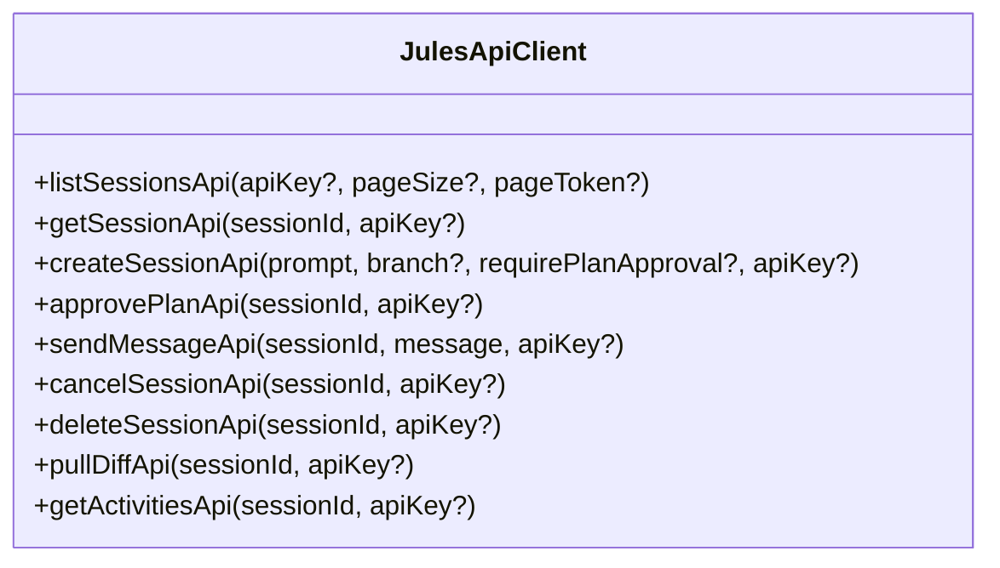

# 02 - API Client Subsystem Reference
**Modules:** [`scripts/client/http.ts`](file:///E:/Data%20Utama/Coding/Antigravity/Jules-Companion/scripts/client/http.ts), [`scripts/client/jules_api.ts`](file:///E:/Data%20Utama/Coding/Antigravity/Jules-Companion/scripts/client/jules_api.ts), [`scripts/jules_client.ts`](file:///E:/Data%20Utama/Coding/Antigravity/Jules-Companion/scripts/jules_client.ts)

---

## 1. Native HTTP Client Architecture (`http.ts`)

[`scripts/client/http.ts`](file:///E:/Data%20Utama/Coding/Antigravity/Jules-Companion/scripts/client/http.ts) implements a lightweight, high-performance HTTP client using Node.js standard library modules (`node:https` and `node:http`) without third-party dependencies such as `axios` or `node-fetch`.

### 1.1. API Key Resolution Chain
The `resolveApiKey(providedKey?: string): string` function resolves the Google Jules authentication token using a predictable priority fallback:
1. Explicit `providedKey` parameter.
2. `JULES_API_KEY` environment variable.
3. `GEMINI_API_KEY` alternative environment variable.
4. Local `.env` file in the current working directory.
5. VS Code configuration property `jules.apiKey`.

### 1.2. HTTP Request Execution
```typescript
export interface HttpRequestOptions {
  url: string;
  method?: 'GET' | 'POST' | 'PUT' | 'DELETE' | 'PATCH';
  headers?: Record<string, string>;
  body?: any;
  apiKey?: string;
  timeoutMs?: number;
}

export interface HttpResponse<T = any> {
  statusCode: number;
  statusMessage: string;
  headers: Record<string, string | string[] | undefined>;
  data: T;
  rawBody: string;
}
```

- **Authentication Headers**: The API key is automatically injected into the request headers:
  ```http
  X-Goog-Api-Key: <resolved_api_key>
  Content-Type: application/json; charset=utf-8
  Accept: application/json
  ```
- **Status Code Evaluation**:
  - `200 - 299`: Success; response body is parsed automatically as JSON if applicable.
  - `400 - 599`: Thrown as an informative `HttpError` containing status code, status message, and raw error body for straightforward debugging.
- **Timeout**: Default request timeout is `30,000 ms` (30 seconds).

---

## 2. Google Jules REST API Mapping (`jules_api.ts`)

[`scripts/client/jules_api.ts`](file:///E:/Data%20Utama/Coding/Antigravity/Jules-Companion/scripts/client/jules_api.ts) maps all official endpoints of Google Jules Cloud API v1alpha (`https://jules.googleapis.com/v1alpha`).

### Complete Endpoint Architecture:



#### 2.1. `listSessionsApi`
- **Method**: `GET /v1alpha/sessions`
- **Purpose**: Fetches the list of cloud sessions associated with the authenticated Google Jules account.
- **Parameters**:
  - `apiKey?: string`: Optional API key override.
  - `pageSize?: number`: Number of records per page (default 50).
  - `pageToken?: string`: Pagination cursor token.
- **Returns**: `{ sessions: SessionRecord[], nextPageToken?: string }`.

#### 2.2. `getSessionApi`
- **Method**: `GET /v1alpha/sessions/{sessionId}`
- **Purpose**: Retrieves the real-time live state of a session directly from the cloud.
- **Returns**: Up-to-date `SessionRecord` including status, branch metadata, timestamps, and activities.

#### 2.3. `createSessionApi`
- **Method**: `POST /v1alpha/sessions`
- **Purpose**: Deploys a new autonomous agent session on Google Jules Cloud.
- **Payload Schema**:
  ```json
  {
    "prompt": "<agent_directives_and_user_task>",
    "sourceContext": {
      "github": {
        "startingBranch": "<target_branch>"
      }
    },
    "requirePlanApproval": true | false
  }
  ```
- **Mode Mapping**:
  - `requirePlanApproval: false` is used for 🚀 **Start** mode.
  - `requirePlanApproval: true` is used for 📑 **Review** and 🎯 **Interactive plan** modes.

#### 2.4. `approvePlanApi`
- **Method**: `POST /v1alpha/sessions/{sessionId}:approvePlan`
- **Purpose**: Authorizes the execution plan formulated by Jules when the session is paused in `AWAITING_PLAN_APPROVAL`.
- **Condition**: Only invoked when the session is strictly waiting for plan authorization.

#### 2.5. `sendMessageApi`
- **Method**: `POST /v1alpha/sessions/{sessionId}:sendMessage`
- **Purpose**: Sends a user reply, response, or follow-up instruction to Jules.
- **Payload**: `{ "message": "<developer_input_text>" }`.
- **Condition**: Used when the session is in `AWAITING_USER_FEEDBACK` or when the developer provides mid-flight guidance.

#### 2.6. `cancelSessionApi` & `deleteSessionApi`
- **`cancelSessionApi`** (`POST /v1alpha/sessions/{sessionId}:cancel`): Halts an active running cloud session cleanly.
- **`deleteSessionApi`** (`DELETE /v1alpha/sessions/{sessionId}`): Permanently removes a session record from the cloud.

#### 2.7. `pullDiffApi`
- **Method**: `GET /v1alpha/sessions/{sessionId}/diff`
- **Purpose**: Downloads the unified Git diff patch representing the code changes created by Jules.

#### 2.8. `getActivitiesApi`
- **Method**: `GET /v1alpha/sessions/{sessionId}/activities`
- **Purpose**: Retrieves step-by-step internal execution events (bash commands executed, files edited, agent reasoning).

---

## 3. Jules CLI Subprocess Wrapper (`jules_client.ts`)

[`scripts/jules_client.ts`](file:///E:/Data%20Utama/Coding/Antigravity/Jules-Companion/scripts/jules_client.ts) provides a fallback wrapper when working in environments where the developer prefers using the local `jules` binary CLI:

- Wraps CLI commands: `jules session new`, `jules session list`, `jules session show`, `jules session approve`.
- Parses formatted terminal stdout/stderr into typed TypeScript structures compatible with the rest of the application.
