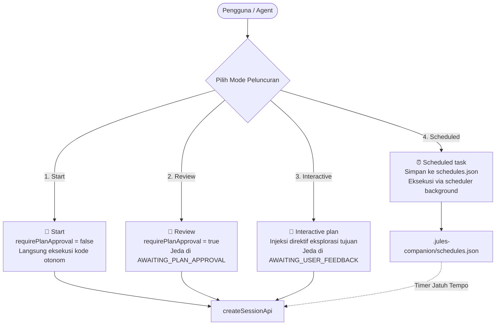

# 03 - Session Lifecycle & Execution Modes Reference
**Modul:** [`scripts/deploy_session.ts`](file:///E:/Data%20Utama/Coding/Antigravity/Jules-Companion/scripts/deploy_session.ts), [`scripts/merge_session.ts`](file:///E:/Data%20Utama/Coding/Antigravity/Jules-Companion/scripts/merge_session.ts), [`scripts/auto_process.ts`](file:///E:/Data%20Utama/Coding/Antigravity/Jules-Companion/scripts/auto_process.ts)

---

## 1. Empat Mode Eksekusi Google Jules

Jules Companion mengimplementasikan secara presisi 4 mode peluncuran yang selaras dengan antarmuka web resmi Google Jules:



### Tabel Perbandingan Spesifikasi Mode:

| Mode | requirePlanApproval | Penyesuaian Prompt | Status Berhenti Pertama | Skenario Penggunaan |
|---|---|---|---|---|
| **Start** (`start`) | `false` | Asli | `RUNNING` -> `SUCCEEDED` | Tugas cepat, perbaikan bug minor, atau tugas yang tidak memerlukan tinjauan rencana terlebih dahulu. |
| **Review** (`review`) | `true` | Asli | `AWAITING_PLAN_APPROVAL` | Refaktor arsitektur, modifikasi berkas sensitif, atau tugas kompleks di mana developer ingin menyetujui langkah-langkah sebelum kode diubah. |
| **Interactive plan** (`interactive`) | `true` | Ditambahkan direktif dialog tujuan | `AWAITING_USER_FEEDBACK` | Tugas dengan kebutuhan yang belum spesifik; Jules akan berdialog untuk memahami tujuan developer sebelum menyusun rencana. |
| **Scheduled task** (`scheduled`) | Ditentukan saat jadwal jatuh tempo | Asli | `pending` (Lokal) | Tugas yang dijadwalkan berjalan di luar jam kerja (misal tengah malam atau esok pagi). |

---

## 2. Deploy Session Engine (`deploy_session.ts`)

Fungsi `deploySessionCore(options: DeploySessionOptions): Promise<DeploySessionResult>` mengorkestrasikan seluruh langkah peluncuran sesi:

```typescript
export interface DeploySessionOptions {
  type: 'interactive' | 'review' | 'start';
  agents: string;
  task: string;
  mode?: 'code' | 'review';
  branch?: string;
  targetDir?: string;
}
```

### Alur Eksekusi Langkah-demi-Langkah:
1. **Validasi Agen**:
   - Memeriksa nama agen pada berkas `registry.json`. Jika nama tidak valid, fungsi mengembalikan daftar nama agen terdaftar yang benar.
2. **Penyusunan Direktif Khusus**:
   - Membaca berkas template markdown agen terkait (`references/agents/{agent}.md`).
   - Menyisipkan peran, tanggung jawab, dan aturan perilaku agen ke dalam prompt akhir.
3. **Penanganan Khusus Mode Interaktif**:
   - Jika `options.type === 'interactive'`, sistem menambahkan instruksi pembuka:
     `"Before creating an execution plan or implementing code, engage in an interactive dialogue to ask clarifying questions and fully understand the project goals."`
4. **Pemeriksaan Branch Git**:
   - Menentukan branch awal. Memeriksa keberadaan remote origin di Git. Jika branch lokal belum dipush ke remote, sistem memberikan rekomendasi atau menggunakan default branch (`main` / `master`).
5. **Pemanggilan API Cloud**:
   - Mengirim request pembuatan sesi melalui `createSessionApi`.
6. **Pencatatan Status Lokal**:
   - Memasukkan sesi baru ke dalam berkas `.jules/sessions.json` secara atomik melalui `saveSessions`.
   - Mengembalikan URL web resmi: `https://jules.google.com/session/{sessionId}`.

---

## 3. Merge Engine & Safety Gate (`merge_session.ts`)

Menggabungkan kode hasil pekerjaan Jules ke branch kerja lokal merupakan operasi kritis. Modul [`scripts/merge_session.ts`](file:///E:/Data%20Utama/Coding/Antigravity/Jules-Companion/scripts/merge_session.ts) dilengkapi dengan **Safety Gate** yang ketat:

### 3.1. Algoritma Safety Gate (`checkSafetyGate`)
Sebelum perintah `git merge` dijalankan, sistem melakukan verifikasi ganda:
1. **Verifikasi Cloud Live**: Memanggil `getSessionApi(sessionId)`.
2. **Evaluasi Status**: Memastikan status sesi di cloud berstatus `SUCCEEDED` atau `COMPLETED`. Jika sesi masih `RUNNING`, `AWAITING_PLAN_APPROVAL`, atau `FAILED`, proses merge **seketika ditolak** untuk mencegah masuknya kode setengah jadi atau korup.
3. **Pemeriksaan Working Tree**: Memastikan working directory Git lokal bersih (`git status --porcelain` kosong) agar tidak menimpa pekerjaan developer yang belum di-commit.

### 3.2. Operasi Penggabungan Kode (`mergeSessionCore`)
1. Menjalankan `git fetch origin {branchName}` untuk mengambil branch hasil pekerjaan Jules dari repositori remote.
2. Melakukan merge dengan opsi `--no-ff` (`git merge origin/{branchName} --no-ff -m "Merge Jules session #{id}"`).
3. Menandai sesi lokal sebagai berstatus `MERGED` dan mencatat timestamp penyelesaian.

### 3.3. Mekanisme Rollback (`rollbackSession`)
Jika setelah penggabungan ditemukan anomali:
- Fungsi `rollbackSession` mendeteksi commit merge terakhir yang dibuat untuk sesi tersebut.
- Mengeksekusi pengembalian keadaan aman melalui `git revert -m 1 <merge_commit_sha>` atau `git reset --hard HEAD~1` (dengan konfirmasi pengguna).

### 3.4. Pembuatan GitHub Pull Request (`createGitHubPR`)
Jika developer memilih untuk tidak melakukan merge langsung ke branch lokal:
- Fungsi memeriksa ketersediaan GitHub CLI (`gh`).
- Menjalankan `gh pr create --base <base_branch> --head <jules_branch> --title <task_title> --body <summary>`.
- Jika `gh` tidak terpasang, membuka peramban web langsung ke halaman pembuatan PR di GitHub (`https://github.com/{owner}/{repo}/compare/...`).

---

## 4. Autonomous Process Loop (`auto_process.ts`)

Modul [`scripts/auto_process.ts`](file:///E:/Data%20Utama/Coding/Antigravity/Jules-Companion/scripts/auto_process.ts) menyediakan alur eksekusi otomatis tanpa henti (*pipeline automation*):
- Meluncurkan sesi Jules.
- Memantau polling kemajuan sesi secara periodik.
- Menyetujui rencana secara otomatis jika mode autonomous diaktifkan dan rencana memenuhi kriteria.
- Mengunduh patch atau menjalankan safety gate merge setelah sesi sukses.
