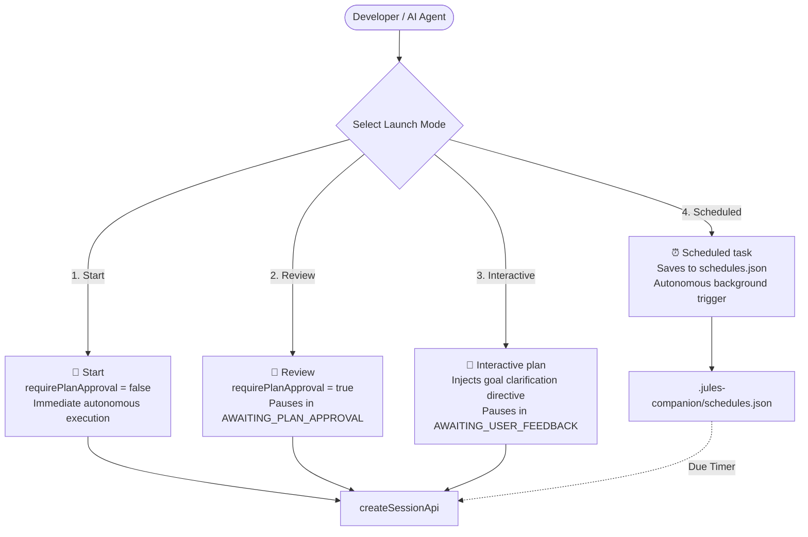

# 03 - Session Lifecycle & Execution Modes Reference
**Modules:** [`scripts/deploy_session.ts`](file:///E:/Data%20Utama/Coding/Antigravity/Jules-Companion/scripts/deploy_session.ts), [`scripts/merge_session.ts`](file:///E:/Data%20Utama/Coding/Antigravity/Jules-Companion/scripts/merge_session.ts), [`scripts/auto_process.ts`](file:///E:/Data%20Utama/Coding/Antigravity/Jules-Companion/scripts/auto_process.ts)

---

## 1. The Four Google Jules Execution Modes

Jules Companion accurately implements all 4 official Google Jules execution modes matching the web console:



### Mode Specification Matrix:

| Mode | requirePlanApproval | Prompt Adjustment | First Pause State | Best Use Cases |
|---|---|---|---|---|
| **Start** (`start`) | `false` | Unmodified | `RUNNING` -> `SUCCEEDED` | Quick tasks, minor bug fixes, or tasks where upfront plan review is unnecessary. |
| **Review** (`review`) | `true` | Unmodified | `AWAITING_PLAN_APPROVAL` | Architectural refactoring, sensitive file changes, or complex features requiring plan review before code generation. |
| **Interactive plan** (`interactive`) | `true` | Injects goal clarification directive | `AWAITING_USER_FEEDBACK` | Open-ended goals where Jules must converse with the developer to clarify scope before formulating a plan. |
| **Scheduled task** (`scheduled`) | Determined upon execution | Unmodified | `pending` (Local queue) | Autonomous overnight or off-peak tasks scheduled for future execution. |

---

## 2. Deploy Session Engine (`deploy_session.ts`)

The `deploySessionCore(options: DeploySessionOptions): Promise<DeploySessionResult>` function coordinates session initialization:

```typescript
export interface DeploySessionOptions {
  type: 'interactive' | 'review' | 'start';
  agents: string;
  task: string;
  mode?: 'code' | 'review';
  branch?: string;
  targetDir?: string;
}
```

### Step-by-Step Execution Lifecycle:
1. **Agent Validation**:
   - Validates the requested agent against `registry.json`. If invalid, returns the complete list of available valid agents.
2. **Directive Assembly**:
   - Reads the specialist agent template markdown (`references/agents/{agent}.md`).
   - Appends role personas, guardrails, and behavioral guidelines to the final prompt.
3. **Interactive Mode Handling**:
   - When `options.type === 'interactive'`, prepends the following conversational directive:
     `"Before creating an execution plan or implementing code, engage in an interactive dialogue to ask clarifying questions and fully understand the project goals."`
4. **Git Branch & Remote Verification**:
   - Inspects active Git branch and remote origin. If local branches have not been pushed, safely falls back to repository default branch (`main` / `master`).
5. **Cloud Deployment**:
   - Dispatches `createSessionApi` with configured `requirePlanApproval` flag.
6. **Local Persistence**:
   - Atomically records the new session into `.jules/sessions.json` via `saveSessions`.
   - Returns the web console link: `https://jules.google.com/session/{sessionId}`.

---

## 3. Merge Engine & Safety Gate (`merge_session.ts`)

Integrating code produced by an autonomous agent into local working branches is a critical operation. [`scripts/merge_session.ts`](file:///E:/Data%20Utama/Coding/Antigravity/Jules-Companion/scripts/merge_session.ts) enforces a strict **Safety Gate**:

### 3.1. Safety Gate Algorithm (`checkSafetyGate`)
Before running any `git merge` command, the engine performs verification checks:
1. **Live Cloud State Check**: Invokes `getSessionApi(sessionId)`.
2. **Status Assertion**: Confirms that cloud status is strictly `SUCCEEDED` or verified completed. If the session is `RUNNING`, `AWAITING_PLAN_APPROVAL`, or `FAILED`, the merge operation is **immediately blocked**.
3. **Working Tree Cleanliness**: Checks that local Git working directory has no uncommitted changes (`git status --porcelain` is empty) to avoid overwriting developer work.

### 3.2. Merge Execution (`mergeSessionCore`)
1. Fetches remote changes: `git fetch origin {branchName}`.
2. Executes merge with `--no-ff`: `git merge origin/{branchName} --no-ff -m "Merge Jules session #{id}"`.
3. Marks local session record status as `MERGED` with completion timestamp.

### 3.3. Safe Rollback Mechanism (`rollbackSession`)
If an issue is detected post-merge:
- Identifies the specific merge commit generated for the session.
- Cleanly reverts or resets to pre-merge state (`git revert -m 1 <merge_commit>` or `git reset --hard HEAD~1` with explicit user confirmation).

### 3.4. GitHub Pull Request Integration (`createGitHubPR`)
If the developer prefers code review via GitHub Pull Request:
- Checks availability of GitHub CLI (`gh`).
- Executes: `gh pr create --base <base_branch> --head <jules_branch> --title <task_title> --body <summary>`.
- Falls back to opening the web browser compare URL if `gh` is not installed.

---

## 4. Autonomous Process Loop (`auto_process.ts`)

[`scripts/auto_process.ts`](file:///E:/Data%20Utama/Coding/Antigravity/Jules-Companion/scripts/auto_process.ts) provides unattended pipeline automation:
- Deploys the requested task to Jules.
- Continuously polls execution progress at regular intervals.
- Approves plans automatically if running in autonomous review mode.
- Pulls diffs and triggers Safety Gate merge upon completion.
