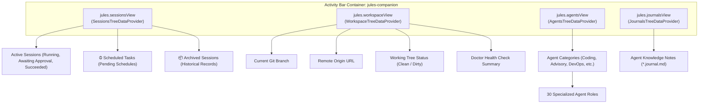

# 04 - VS Code Extension & UI Layer Reference
**Modul:** [`scripts/extension.ts`](file:///E:/Data%20Utama/Coding/Antigravity/Jules-Companion/scripts/extension.ts), [`scripts/ui/sessions_provider.ts`](file:///E:/Data%20Utama/Coding/Antigravity/Jules-Companion/scripts/ui/sessions_provider.ts), [`scripts/ui/workspace_provider.ts`](file:///E:/Data%20Utama/Coding/Antigravity/Jules-Companion/scripts/ui/workspace_provider.ts), [`scripts/ui/agents_provider.ts`](file:///E:/Data%20Utama/Coding/Antigravity/Jules-Companion/scripts/ui/agents_provider.ts), [`scripts/ui/journals_provider.ts`](file:///E:/Data%20Utama/Coding/Antigravity/Jules-Companion/scripts/ui/journals_provider.ts), [`scripts/ui/live_sync.ts`](file:///E:/Data%20Utama/Coding/Antigravity/Jules-Companion/scripts/ui/live_sync.ts), [`scripts/ui/visual_diff.ts`](file:///E:/Data%20Utama/Coding/Antigravity/Jules-Companion/scripts/ui/visual_diff.ts), [`scripts/ui/custom_agent_wizard.ts`](file:///E:/Data%20Utama/Coding/Antigravity/Jules-Companion/scripts/ui/custom_agent_wizard.ts)

---

## 1. Extension Controller (`extension.ts`)

File [`scripts/extension.ts`](file:///E:/Data%20Utama/Coding/Antigravity/Jules-Companion/scripts/extension.ts) adalah titik masuk (*entry point*) ekstensi yang diinisialisasi oleh VS Code dan Antigravity IDE saat ekstensi diaktifkan (`activate`).

### 1.1. Siklus Hidup Ekstensi
- **`activate(context: vscode.ExtensionContext)`**:
  - Menginisialisasi status bar items (`statusBarItem`, `liveSyncBarItem`).
  - Mendaftarkan 4 TreeDataProvider ke container activity bar `jules-companion`.
  - Mendaftarkan seluruh 33 VS Code Commands.
  - Memulai `LiveSyncManager` untuk sinkronisasi latar belakang.
  - Memasang `FileSystemWatcher` pada `**/.jules*/**/*.{json}` untuk menyegarkan tampilan secara otomatis ketika ada pembaruan sesi atau jadwal.
- **`deactivate()`**:
  - Menghentikan timer LiveSync background.
  - Membuang (*dispose*) status bar items dan watcher.

### 1.2. Ringkasan Registrasi Perintah (33 Commands)

| Kategori | ID Perintah | Judul / Aksi |
|---|---|---|
| **Sesi & Deployment** | `jules.deploySession` | Menampilkan wizard 3-langkah (Prompt -> Agen -> 4 Mode Eksekusi). |
| | `jules.deployWithAgent` | Meluncurkan sesi dengan agen tertentu dari pohon agen. |
| | `jules.approvePlan` | Mengirim persetujuan rencana untuk sesi `AWAITING_PLAN_APPROVAL`. |
| | `jules.sendMessage` | Membuka prompt pesan untuk membalas sesi yang membutuhkan masukan. |
| | `jules.mergeSession` | Menjalankan safety gate dan menggabungkan branch sesi ke branch lokal. |
| | `jules.rollbackSession` | Mengembalikan working tree ke kondisi sebelum merge. |
| | `jules.cancelSession` | Membatalkan sesi aktif di cloud. |
| | `jules.deleteSession` | Menghapus sesi dari riwayat lokal/cloud. |
| | `jules.archiveSession` | Memindahkan sesi selesai/gagal ke grup arsip. |
| | `jules.unarchiveSession` | Mengembalikan sesi dari arsip ke daftar aktif. |
| | `jules.retryFailedSession` | Mencoba ulang sesi yang gagal dengan parameter awal. |
| | `jules.checkoutSessionBranch`| Melakukan git checkout ke branch yang dibuatkan Jules. |
| **Scheduler Otonom** | `jules.scheduleTask` | Menjadwalkan tugas baru dengan pemilihan delay/waktu. |
| | `jules.viewScheduledTasks` | Menampilkan daftar seluruh jadwal aktif & selesai. |
| | `jules.viewScheduledTaskDetail` | Melihat rincian instruksi dan waktu target. |
| | `jules.runScheduledTaskNow` | Memaksa eksekusi tugas terjadwal seketika. |
| | `jules.cancelScheduledTask` | Membatalkan jadwal tugas tertunda. |
| **Tampilan & Webview** | `jules.openMissionControl` | Membuka Mission Control Webview interaktif. |
| | `jules.viewVisualDiff` | Membuka native diff viewer untuk perubahan kode sesi. |
| | `jules.viewActivities` | Menampilkan riwayat langkah-langkah aktivitas Jules. |
| | `jules.openInWeb` | Membuka sesi di Google Jules Web Console. |
| | `jules.copySessionUrl` | Menyalin tautan web sesi ke clipboard sistem. |
| **Integrasi & Utilitas**| `jules.createGitHubPR` | Membuat PR resmi di GitHub menggunakan GitHub CLI atau browser. |
| | `jules.setApiKey` | Menyimpan Kunci API Google Jules secara aman. |
| | `jules.runDoctor` | Menjalankan pemeriksaan kesehatan sistem dan dependensi. |
| | `jules.toggleLiveSync` | Menyalakan/mematikan pemantauan live polling background. |
| | `jules.createCustomAgent` | Membuka wizard pembuatan template agen AI baru. |
| | `jules.openAgentDoc` | Membuka dokumentasi markdown dari agen yang dipilih. |
| | `jules.refreshSessions` | Memperbarui daftar sesi di sidebar secara manual. |
| | `jules.refreshWorkspace` | Memperbarui status repositori workspace di sidebar. |

---

## 2. Tree Data Providers Subsystem

Sidebar Jules Companion menyajikan 4 panel hierarkis di Activity Bar:



### 2.1. `SessionsTreeDataProvider` (`ui/sessions_provider.ts`)
- **Root Items**: Memisahkan sesi aktif, grup tugas terjadwal (`⏰ Scheduled Tasks (N pending)`), dan grup arsip (`📦 Archived Sessions (N)`).
- **Sub-Items**: Setiap sesi dapat diperluas (*expanded*) untuk melihat detail spesifik:
  - `Task`: Rincian prompt developer.
  - `Branch`: Nama branch Git yang diasosiasikan.
  - `Agent`: Nama agen yang ditugaskan.
  - `Status`: Lencana status visual dengan ikon tematik (`sync~spin` untuk running, `checklist` untuk awaiting approval, `comment` untuk awaiting input, `check` untuk succeeded, `error` untuk failed).
  - **Inline Action Context Items**: Item khusus yang muncul otomatis sesuai status (e.g. `Approve Plan` hanya muncul pada status menunggu persetujuan).
- **Fungsi `resolveSessionId`**: Helper tangguh yang dapat mengekstrak ID sesi baik dari objek `SessionTreeItem`, raw `SessionRecord`, wrapper object, maupun string ID langsung.

### 2.2. `WorkspaceTreeDataProvider` (`ui/workspace_provider.ts`)
- Memberikan visualisasi cepat konteks Git workspace aktif:
  - Branch lokal aktif.
  - Remote origin URL (mendukung parsing format SSH dan HTTPS).
  - Jumlah berkas yang belum di-commit (*dirty tree warning*).
  - Status konektivitas dan Kunci API.

### 2.3. `AgentsTreeDataProvider` & `JournalsTreeDataProvider`
- Mengorganisir 30 agen spesialis berdasarkan grup fungsional.
- Memberikan akses cepat untuk membaca berkas panduan markdown agen dan berkas catatan jurnal pembelajaran agen.

---

## 3. Live Sync Manager Subsystem (`ui/live_sync.ts`)

Kelas `LiveSyncManager` bertindak sebagai *heartbeat engine* yang menjaga antarmuka IDE selalu sinkron dengan Google Jules Cloud:

```typescript
export class LiveSyncManager {
  private timer: NodeJS.Timeout | null = null;
  private intervalMs: number = 30000; // Polling setiap 30 detik
  
  public start(): void;
  public stop(): void;
  public toggle(): boolean;
  public isActive(): boolean;
  public async pollOnce(): Promise<void>;
}
```

### Tanggung Jawab Siklus `pollOnce`:
1. **Trigger Scheduler**: Memanggil `executeDueTasks(root)`. Jika ada tugas terjadwal yang jatuh tempo, sistem langsung mengeksekusinya dan memunculkan notifikasi IDE.
2. **Sinkronisasi Sesi Cloud**: Memanggil `listSessionsApi()` untuk mengambil status cloud terbaru.
3. **Deteksi Intervensi Pengguna**:
   - Jika ada sesi yang bertransisi ke `AWAITING_PLAN_APPROVAL`, IDE menampilkan notifikasi interaktif: `"Plan approval required for session #{id}!"` dengan tombol aksi `Approve Plan` dan `Open Mission Control`.
   - Jika sesi bertransisi ke `AWAITING_USER_FEEDBACK`, IDE menampilkan notifikasi masukan: `"Jules needs your feedback on session #{id}!"` dengan tombol `Reply to Agent`.
4. **Penyegaran Tampilan**: Memperbarui metrik badge status bar dan menyegarkan TreeView.

---

## 4. Visual Diff Viewer (`ui/visual_diff.ts`)

Modul [`scripts/ui/visual_diff.ts`](file:///E:/Data%20Utama/Coding/Antigravity/Jules-Companion/scripts/ui/visual_diff.ts) memungkinkan developer melihat perbedaan kode yang dihasilkan Jules langsung menggunakan native diff editor bawaan VS Code tanpa harus melakukan checkout branch:
1. Mengambil git patch mentah dari `pullDiffApi` atau `git diff`.
2. Mem-parsing header file, chunk lines (`+`, `-`, ` `).
3. Menyimpan snapshot berkas sementara (*virtual document*) dan memanggil perintah `vscode.diff` dengan judul yang ramah pengguna: `"Jules Proposed Changes: filename.ts"`.

---

## 5. Custom Agent Wizard (`ui/custom_agent_wizard.ts`)

Menyediakan panduan interaktif langkah-demi-langkah bagi developer untuk merancang agen AI baru:
1. Meminta input nama agen (e.g. `graphql-expert`).
2. Meminta pemilihan grup peran (`Coding`, `Advisory`, `DevOps`, `Architecture`, `Testing`).
3. Meminta penulisan deskripsi direktif sistem.
4. Membuat berkas markdown baru di `references/agents/{name}.md` dengan frontmatter standar.
5. Memperbarui `registry.json` secara otomatis dan menyegarkan pohon agen di sidebar.
