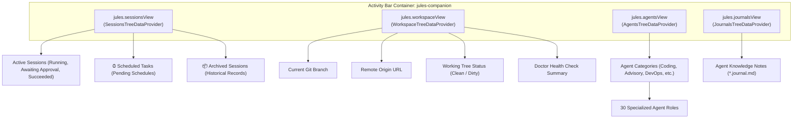

# 04 - VS Code Extension & UI Layer Reference
**Modules:** [`scripts/extension.ts`](file:///E:/Data%20Utama/Coding/Antigravity/Jules-Companion/scripts/extension.ts), [`scripts/ui/sessions_provider.ts`](file:///E:/Data%20Utama/Coding/Antigravity/Jules-Companion/scripts/ui/sessions_provider.ts), [`scripts/ui/workspace_provider.ts`](file:///E:/Data%20Utama/Coding/Antigravity/Jules-Companion/scripts/ui/workspace_provider.ts), [`scripts/ui/agents_provider.ts`](file:///E:/Data%20Utama/Coding/Antigravity/Jules-Companion/scripts/ui/agents_provider.ts), [`scripts/ui/journals_provider.ts`](file:///E:/Data%20Utama/Coding/Antigravity/Jules-Companion/scripts/ui/journals_provider.ts), [`scripts/ui/live_sync.ts`](file:///E:/Data%20Utama/Coding/Antigravity/Jules-Companion/scripts/ui/live_sync.ts), [`scripts/ui/visual_diff.ts`](file:///E:/Data%20Utama/Coding/Antigravity/Jules-Companion/scripts/ui/visual_diff.ts), [`scripts/ui/custom_agent_wizard.ts`](file:///E:/Data%20Utama/Coding/Antigravity/Jules-Companion/scripts/ui/custom_agent_wizard.ts)

---

## 1. Extension Controller (`extension.ts`)

[`scripts/extension.ts`](file:///E:/Data%20Utama/Coding/Antigravity/Jules-Companion/scripts/extension.ts) is the master lifecycle entry point initialized by VS Code and Antigravity IDE upon extension activation (`activate`).

### 1.1. Lifecycle Hooks
- **`activate(context: vscode.ExtensionContext)`**:
  - Initializes status bar items (`statusBarItem`, `liveSyncBarItem`).
  - Registers 4 TreeDataProviders into the `jules-companion` activity bar container.
  - Registers all 33 VS Code Commands.
  - Starts `LiveSyncManager` for background synchronization.
  - Registers `FileSystemWatcher` on `**/.jules*/**/*.{json}` to refresh views upon state changes.
- **`deactivate()`**:
  - Halts the LiveSync polling timer.
  - Disposes status bar items and file system watchers.

### 1.2. Complete Command Registry (33 Commands)

| Category | Command ID | Action Description |
|---|---|---|
| **Sessions & Deployment** | `jules.deploySession` | 3-step QuickPick wizard (Task Prompt -> Agent -> 4 Launch Modes). |
| | `jules.deployWithAgent` | Deploys a session directly using selected agent. |
| | `jules.approvePlan` | Sends plan approval for sessions in `AWAITING_PLAN_APPROVAL`. |
| | `jules.sendMessage` | Opens input box to reply to sessions awaiting feedback. |
| | `jules.mergeSession` | Runs safety gate and merges session branch into local branch. |
| | `jules.rollbackSession` | Safely reverts merge commit from local branch. |
| | `jules.cancelSession` | Cancels an active cloud session. |
| | `jules.deleteSession` | Permanently deletes a session record from local/cloud. |
| | `jules.archiveSession` | Moves completed/failed session to archived group. |
| | `jules.unarchiveSession` | Restores archived session back to active list. |
| | `jules.retryFailedSession` | Retries a failed session using initial parameters. |
| | `jules.checkoutSessionBranch`| Checks out the Git branch created by Jules. |
| **Autonomous Scheduler** | `jules.scheduleTask` | Schedules a new task with delay or specific time. |
| | `jules.viewScheduledTasks` | Displays list of scheduled tasks with management options. |
| | `jules.viewScheduledTaskDetail` | Views prompt, target time, and metadata. |
| | `jules.runScheduledTaskNow` | Force-executes a scheduled task immediately. |
| | `jules.cancelScheduledTask` | Cancels a pending scheduled task. |
| **Native UI Controls** | `jules.openSessionActionCenter` | Opens native QuickPick Action Center for full session control. |
| | `jules.streamActivityLog` | Streams live cloud execution steps & bash logs to OutputChannel. |
| | `jules.viewVisualDiff` | Opens native side-by-side diff (`vscode.diff`) with in-memory buffers. |
| | `jules.openInWeb` | Opens session directly in Google Jules Web Console. |
| | `jules.copySessionUrl` | Copies web console URL to clipboard. |
| **Integrations & Utils**| `jules.createGitHubPR` | Creates a GitHub Pull Request using GitHub CLI or browser. |
| | `jules.setApiKey` | Securely stores Google Jules API key. |
| | `jules.runDoctor` | Executes environment and dependency health checks. |
| | `jules.toggleLiveSync` | Toggles background polling loop. |
| | `jules.createCustomAgent` | Launches custom agent scaffolding wizard. |
| | `jules.openAgentDoc` | Opens markdown documentation for selected agent. |
| | `jules.refreshSessions` | Manually refreshes session tree view. |
| | `jules.refreshWorkspace` | Manually refreshes workspace Git context. |

---

## 2. Tree Data Providers Subsystem

The extension presents 4 hierarchical panels in the Activity Bar:



### 2.1. `SessionsTreeDataProvider` (`ui/sessions_provider.ts`)
- **Root Level**: Groups items into Active Sessions, Scheduled Tasks (`⏰ Scheduled Tasks (N pending)`), and Archived Sessions (`📦 Archived Sessions (N)`).
- **Sub-Items**: Each session expands to show Task prompt, Branch, Agent, Status badge, and contextual action items (e.g., `Approve Plan` only renders when awaiting approval).
- **`resolveSessionId`**: Universal resolver unpacking session IDs from TreeItems, raw session objects, wrappers, or string IDs.

### 2.2. `WorkspaceTreeDataProvider` (`ui/workspace_provider.ts`)
- Inspects repository status: active branch, remote origin (parsing SSH and HTTPS), working tree cleanliness, and Doctor health summary.

### 2.3. `AgentsTreeDataProvider` & `JournalsTreeDataProvider`
- Organizes 30 specialist agents by functional group.
- Provides direct navigation to agent role documents and operational decision journals.

---

## 3. Live Sync Manager Subsystem (`ui/live_sync.ts`)

The `LiveSyncManager` acts as the extension heartbeat engine:

```typescript
export class LiveSyncManager {
  private timer: NodeJS.Timeout | null = null;
  private intervalMs: number = 30000; // 30-second polling interval
  
  public start(): void;
  public stop(): void;
  public toggle(): boolean;
  public isActive(): boolean;
  public async pollOnce(): Promise<void>;
}
```

### `pollOnce` Execution Routine:
1. **Scheduler Trigger**: Calls `executeDueTasks(root)`. Automatically fires due tasks and alerts the developer.
2. **Cloud Sync**: Calls `listSessionsApi()` to refresh cloud session statuses.
3. **Interactive Notifications**:
   - `AWAITING_PLAN_APPROVAL`: Shows `"Plan approval required for session #{id}!"` with action buttons `Approve Plan` and `Action Center`.
   - `AWAITING_USER_FEEDBACK`: Shows `"Jules needs your feedback on session #{id}!"` with button `Reply to Agent`.
4. **View Updates**: Updates status bar metrics and triggers TreeView refresh.

---

## 4. Visual Diff Viewer (`ui/visual_diff.ts`)

[`scripts/ui/visual_diff.ts`](file:///E:/Data%20Utama/Coding/Antigravity/Jules-Companion/scripts/ui/visual_diff.ts) allows reviewing proposed code changes without checking out branches:
1. Fetches unified Git diff patch from `pullDiffApi` or `git diff`.
2. Parses file headers and diff chunks.
3. Reconstructs before/after states and launches native VS Code diff editor (`vscode.diff`).

---

## 5. Custom Agent Wizard (`ui/custom_agent_wizard.ts`)

Provides an interactive GUI wizard for creating custom specialist agents:
1. Prompts for agent name (e.g., `graphql-expert`).
2. Prompts for functional group selection (`Coding`, `Advisory`, `DevOps`, `Architecture`, `Testing`).
3. Prompts for core behavioral directives.
4. Scaffolds `references/agents/{name}.md` with standard YAML frontmatter.
5. Updates `registry.json` and refreshes the sidebar agent tree.
