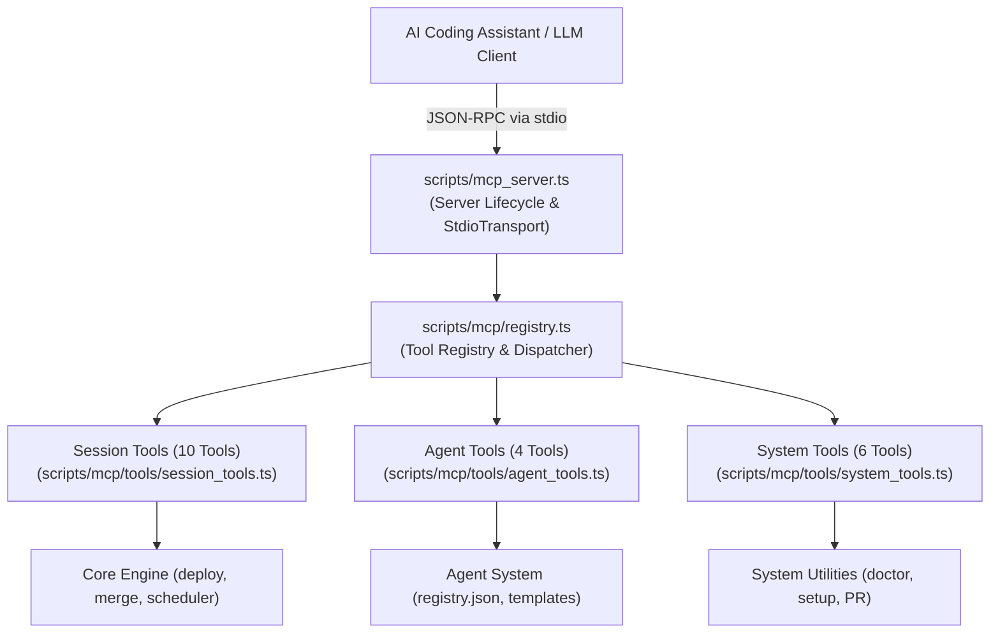

# 06 - Model Context Protocol (MCP) Server Subsystem
**Modul:** [`scripts/mcp_server.ts`](file:///E:/Data%20Utama/Coding/Antigravity/Jules-Companion/scripts/mcp_server.ts), [`scripts/mcp/registry.ts`](file:///E:/Data%20Utama/Coding/Antigravity/Jules-Companion/scripts/mcp/registry.ts), [`scripts/mcp/tools/session_tools.ts`](file:///E:/Data%20Utama/Coding/Antigravity/Jules-Companion/scripts/mcp/tools/session_tools.ts), [`scripts/mcp/tools/agent_tools.ts`](file:///E:/Data%20Utama/Coding/Antigravity/Jules-Companion/scripts/mcp/tools/agent_tools.ts), [`scripts/mcp/tools/system_tools.ts`](file:///E:/Data%20Utama/Coding/Antigravity/Jules-Companion/scripts/mcp/tools/system_tools.ts)

---

## 1. Arsitektur Server MCP

Jules Companion menyertakan server **Model Context Protocol (MCP)** resmi berbasis SDK `@modelcontextprotocol/sdk`. Protokol ini memungkinkan agen AI eksternal (seperti Claude Desktop, Antigravity CLI, atau Hermes) untuk mengendalikan seluruh kapabilitas Google Jules secara programatis melalui saluran komunikasi standar JSON-RPC melalui `stdio`.



---

## 2. Dynamic Tool Registry (`mcp/registry.ts`)

Kelas `McpToolRegistry` bertindak sebagai pengelola dan validator seluruh alat (*tools*) yang diekspos ke klien MCP:

```typescript
export interface McpToolDefinition {
  name: string;
  description: string;
  inputSchema: {
    type: 'object';
    properties: Record<string, any>;
    required?: string[];
  };
  handler: (args: any) => Promise<any>;
}
```

### Kemampuan Registri:
- **Validasi Skema**: Memastikan setiap alat memiliki deskripsi yang jelas dan skema masukan bertipe JSON Schema standar yang dapat dipahami oleh LLM.
- **Penanganan Kesalahan Terisolasi**: Jika suatu alat gagal dijalankan, server tidak akan crash; melainkan mengembalikan pesan kesalahan terstruktur dengan format `isError: true` ke klien.
- **Katalog Lengkap**: Mengekspos tepat 20 alat native terdaftar.

---

## 3. Katalog Lengkap 20 MCP Tools

### 3.1. Session Management Tools (`session_tools.ts`)

| Tool Name | Parameter Masukan | Deskripsi & Kegunaan |
|---|---|---|
| `deploy_session` | `task: string`, `agents?: string`, `mode?: 'code' \| 'review'`, `type?: 'start' \| 'review' \| 'interactive'`, `branch?: string` | Meluncurkan sesi Jules baru ke Google Cloud dengan opsi pemilihan mode peluncuran resmi. |
| `merge_session` | `sessionId?: string`, `branch?: string` | Memvalidasi safety gate dan menggabungkan hasil pekerjaan sesi ke branch lokal. |
| `get_session_status`| `sessionId: string` | Mengambil status cloud terkini, branch, dan ringkasan aktivitas sesi. |
| `cancel_session` | `sessionId: string` | Membatalkan sesi aktif yang sedang berjalan di Google Cloud. |
| `send_session_message` | `sessionId: string`, `message: string` | Mengirim pesan balasan atau instruksi lanjutan kepada agen Jules. |
| `retry_failed_session`| `sessionId: string` | Mengambil parameter sesi yang gagal dan meluncurkan sesi baru secara otomatis. |
| `deploy_team` | `team: string[]`, `task: string` | Meluncurkan beberapa sesi paralel untuk beberapa agen spesialis sekaligus. |
| `pull_session_diff` | `sessionId: string` | Mengambil unified diff patch dari perubahan kode sesi. |
| `checkout_session_branch` | `sessionId: string` | Melakukan git checkout ke branch yang dibuatkan oleh Jules. |
| `rollback_session` | `sessionId: string` | Membatalkan commit merge sesi dari branch kerja lokal secara aman. |

### 3.2. Agent Management Tools (`agent_tools.ts`)

| Tool Name | Parameter Masukan | Deskripsi & Kegunaan |
|---|---|---|
| `list_agents` | *(Tanpa argumen)* | Mengembalikan daftar 30 agen spesialis beserta peran dan deskripsi masing-masing. |
| `get_agent_info` | `agentName: string` | Mengembalikan teks instruksi sistem lengkap dan aturan direktif dari agen tertentu. |
| `create_custom_agent` | `name: string`, `role: string`, `directives: string`, `group?: string` | Membuat template agen baru dan mendaftarkannya ke `registry.json`. |
| `read_agent_journal` | `agentName: string` | Membaca catatan pembelajaran dan histori kerja dari berkas jurnal agen. |

### 3.3. System & Workflow Tools (`system_tools.ts`)

| Tool Name | Parameter Masukan | Deskripsi & Kegunaan |
|---|---|---|
| `auto_process` | `task: string`, `agents?: string` | Menjalankan pipeline otomatis: deploy -> pantau -> setujui rencana -> merge saat sukses. |
| `setup_workspace` | `targetDir?: string` | Mempersiapkan struktur direktori kerja `.jules/` dan berkas konfigurasi awal. |
| `list_sources` | `targetDir?: string` | Menginventarisasi berkas-berkas kode dan konfigurasi yang relevan di workspace. |
| `run_doctor` | `targetDir?: string` | Menjalankan audit kesehatan lingkungan (ketersediaan Git, Node.js, API Key, dan konektivitas). |
| `create_github_pr` | `sessionId: string`, `baseBranch?: string`, `title?: string`, `body?: string` | Membuat GitHub Pull Request dari branch sesi menggunakan GitHub CLI (`gh`). |
| `get_review_reports`| `targetDir?: string` | Mengambil daftar laporan tinjauan kode yang tersimpan di `docs/jules-reviews/`. |

---

## 4. Konfigurasi MCP Client

Untuk menghubungkan Jules Companion ke klien AI (misal `claude_desktop_config.json` atau konfigurasi MCP Antigravity CLI), tambahkan blok server berikut:

```json
{
  "mcpServers": {
    "jules-companion": {
      "command": "node",
      "args": [
        "E:\\Data Utama\\Coding\\Antigravity\\Jules-Companion\\dist\\mcp_server.js"
      ],
      "env": {
        "JULES_API_KEY": "<your_api_key_here>"
      }
    }
  }
}
```
