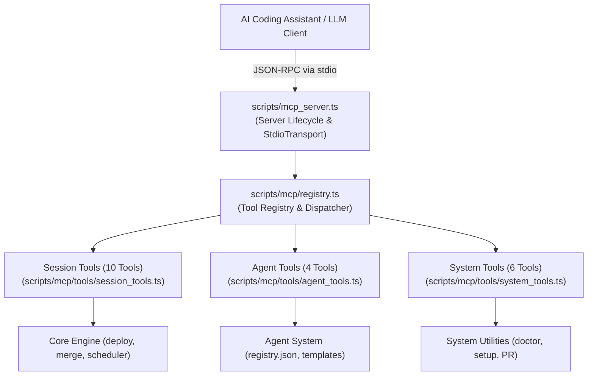

# 06 - Model Context Protocol (MCP) Server Subsystem
**Modules:** [`scripts/mcp_server.ts`](file:///E:/Data%20Utama/Coding/Antigravity/Jules-Companion/scripts/mcp_server.ts), [`scripts/mcp/registry.ts`](file:///E:/Data%20Utama/Coding/Antigravity/Jules-Companion/scripts/mcp/registry.ts), [`scripts/mcp/tools/session_tools.ts`](file:///E:/Data%20Utama/Coding/Antigravity/Jules-Companion/scripts/mcp/tools/session_tools.ts), [`scripts/mcp/tools/agent_tools.ts`](file:///E:/Data%20Utama/Coding/Antigravity/Jules-Companion/scripts/mcp/tools/agent_tools.ts), [`scripts/mcp/tools/system_tools.ts`](file:///E:/Data%20Utama/Coding/Antigravity/Jules-Companion/scripts/mcp/tools/system_tools.ts)

---

## 1. MCP Server Architecture

Jules Companion embeds a full **Model Context Protocol (MCP)** server built on `@modelcontextprotocol/sdk`. This open standard allows external AI models (such as Claude Desktop, Antigravity CLI, or Hermes) to programmatically interact with Google Jules via JSON-RPC over `stdio`.



---

## 2. Dynamic Tool Registry (`mcp/registry.ts`)

The `McpToolRegistry` class manages and validates all tools exposed to MCP clients:

```typescript
export interface McpToolDefinition {
  name: string;
  description: string;
  inputSchema: {
    type: 'object';
    properties: Record<string, any>;
    required?: string[];
  };
  handler: (args: any) => Promise<any>;
}
```

### Registry Features:
- **Schema Validation**: Guarantees that every tool has an accurate description and standard JSON Schema parameters easily parsed by LLMs.
- **Isolated Error Handling**: If a tool handler throws, the server does not crash; it returns a structured error object with `isError: true`.
- **Complete Suite**: Exposes exactly 20 validated native tools.

---

## 3. Catalog of the 20 Native MCP Tools

### 3.1. Session Management Tools (`session_tools.ts`)

| Tool Name | Input Parameters | Description |
|---|---|---|
| `deploy_session` | `task: string`, `agents?: string`, `mode?: 'code' \| 'review'`, `type?: 'start' \| 'review' \| 'interactive'`, `branch?: string` | Deploys a new Jules session with official launch mode support. |
| `merge_session` | `sessionId?: string`, `branch?: string` | Verifies safety gate and merges session branch into local branch. |
| `get_session_status`| `sessionId: string` | Retrieves live cloud status, branch name, and activity summary. |
| `cancel_session` | `sessionId: string` | Cancels an active running cloud session. |
| `send_session_message` | `sessionId: string`, `message: string` | Sends feedback or follow-up instructions to Jules. |
| `retry_failed_session`| `sessionId: string` | Retries a failed session using initial task parameters. |
| `deploy_team` | `team: string[]`, `task: string` | Deploys parallel sessions for multiple specialist agents simultaneously. |
| `pull_session_diff` | `sessionId: string` | Fetches unified Git diff patch of changes made in the session. |
| `checkout_session_branch` | `sessionId: string` | Checks out the Git branch created by Jules locally. |
| `rollback_session` | `sessionId: string` | Safely reverts a session merge commit from local branch. |

### 3.2. Agent Management Tools (`agent_tools.ts`)

| Tool Name | Input Parameters | Description |
|---|---|---|
| `list_agents` | *(No arguments)* | Lists all 30 specialist agents with their roles and descriptions. |
| `get_agent_info` | `agentName: string` | Returns system prompt directives and guardrails for a specific agent. |
| `create_custom_agent` | `name: string`, `role: string`, `directives: string`, `group?: string` | Scaffolds a new agent template and registers it in `registry.json`. |
| `read_agent_journal` | `agentName: string` | Reads operational insights and historical notes from agent journal file. |

### 3.3. System & Workflow Tools (`system_tools.ts`)

| Tool Name | Input Parameters | Description |
|---|---|---|
| `auto_process` | `task: string`, `agents?: string` | Autonomous pipeline: deploy -> monitor -> approve plan -> merge upon success. |
| `setup_workspace` | `targetDir?: string` | Scaffolds `.jules/` directory structure and initial state files. |
| `list_sources` | `targetDir?: string` | Inventories source files and configuration in current workspace. |
| `run_doctor` | `targetDir?: string` | Audits system health (Git, Node.js, API Key, registry integrity). |
| `create_github_pr` | `sessionId: string`, `baseBranch?: string`, `title?: string`, `body?: string` | Creates a GitHub Pull Request from session branch via GitHub CLI (`gh`). |
| `get_review_reports`| `targetDir?: string` | Fetches code review report files stored in `docs/jules-reviews/`. |

---

## 4. MCP Client Configuration Example

To connect Jules Companion with an AI coding assistant (e.g., `claude_desktop_config.json` or Antigravity CLI MCP settings):

```json
{
  "mcpServers": {
    "jules-companion": {
      "command": "node",
      "args": [
        "E:\\Data Utama\\Coding\\Antigravity\\Jules-Companion\\dist\\mcp_server.js"
      ],
      "env": {
        "JULES_API_KEY": "<your_api_key_here>"
      }
    }
  }
}
```
