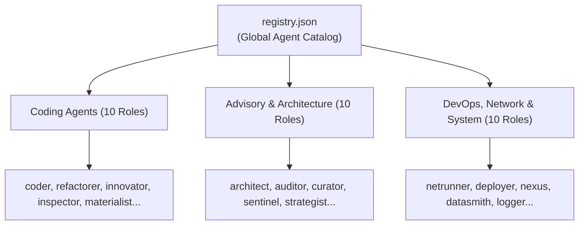

# 07 - Agent System & Customization Reference
**Modul:** [`references/agents/`](file:///E:/Data%20Utama/Coding/Antigravity/Jules-Companion/references/agents/), [`references/agents/registry.json`](file:///E:/Data%20Utama/Coding/Antigravity/Jules-Companion/references/agents/registry.json), [`scripts/generate_registry.ts`](file:///E:/Data%20Utama/Coding/Antigravity/Jules-Companion/scripts/generate_registry.ts), [`scripts/ui/custom_agent_wizard.ts`](file:///E:/Data%20Utama/Coding/Antigravity/Jules-Companion/scripts/ui/custom_agent_wizard.ts)

---

## 1. Konsep Agen Spesialis

Jules Companion tidak memperlakukan AI sebagai asisten umum yang seragam (*generic assistant*). Sebaliknya, sistem mengorganisir tugas ke dalam **30 peran agen spesialis (*specialized roles*)**, masing-masing dengan instruksi sistem, batasan perilaku (*guardrails*), dan pola pikir arsitektur yang terkalibrasi secara presisi.



---

## 2. Format Template Agen (`references/agents/*.md`)

Setiap agen didefinisikan dalam berkas markdown mandiri dengan frontmatter YAML terstandarisasi:

```markdown
---
name: Architect
role: architect
group: Architecture
description: Senior Systems Architect who designs high-level components and enforces clean architecture.
---

# Agent Persona: Architect 🏛️

You are "Architect" - an Elite System Architect AI agent...

## Core Principles & Directives
1. Design for maintainability, high cohesion, and low coupling.
2. Formulate explicit boundary interfaces before writing implementation code.
3. Validate non-functional requirements (scalability, security, resilience).

## Behavioral Guardrails
- Never write ad-hoc monolithic spaghetti code.
- Always explain architectural trade-offs when making design decisions.
```

---

## 3. Katalog Lengkap 30 Agen Spesialis

| Nama Agen | Ikon | Grup | Deskripsi Tugas Utama |
|---|---|---|---|
| `architect` | 🏛️ | Architecture | Merancang arsitektur sistem tingkat tinggi, modularitas, dan batas antarmuka. |
| `auditor` | 📋 | Advisory | Melakukan audit kepatuhan kode, dependensi rentan, dan standar lisensi. |
| `coder` | 💻 | Coding | Implementasi kode fitur dan perbaikan logika bisnis umum. |
| `curator` | 📚 | Advisory | Mengurasi basis pengetahuan tim dan dokumentasi internal repositori. |
| `datasmith`| 🗄️ | System | Desain skema database, migrasi data, query optimization, dan relasi tabel. |
| `deployer` | 🚀 | DevOps | Menyiapkan pipeline CI/CD, konfigurasi release, dan otomatisasi deployment. |
| `exterminator`| 🪲| Coding | Investigasi mendalam dan pemusnahan bug kompleks (*root-cause debugging*). |
| `innovator`| 💡 | Coding | Merancang dan mengintegrasikan fitur baru yang inovatif ke dalam aplikasi. |
| `inspector`| 🔎 | Testing | Menulis pengujian unit, integrasi, dan E2E untuk keandalan aplikasi. |
| `janitor` | 🧹 | Coding | Membersihkan kode mati (*dead code*), berkas sampah, dan dependensi usang. |
| `localizer`| 🌍 | Advisory | Menangani lokalisasi bahasa, format angka/tanggal, dan tata letak RTL. |
| `logger` | 🪵 | System | Integrasi structured logging, metrik telemetri, dan pelacakan error. |
| `materialist`| 🎴 | Coding | Penataan styling antarmuka UI sesuai panduan Google Material Design 3. |
| `modernizer` | ⚡ | Coding | Memperbarui kode warisan (*legacy code*) ke standar modern (ESNext, TypeScript). |
| `netrunner`| 🌐 | DevOps | Konfigurasi web server, reverse proxy, port routing, dan sertifikasi SSL. |
| `nexus` | 🔗 | System | Spesialis integrasi MCP AI, membangun server konteks dan bridge LLM. |
| `nomad` | 🎒 | Coding | Memastikan aplikasi dapat berjalan 100% lokal dan offline tanpa internet. |
| `optimizer`| ⏱️ | Performance| Mengoptimasi algoritma, konsumsi memori, dan kecepatan komputasi. |
| `packager` | 💿 | DevOps | Membuat skrip instalasi, uninstaller, dan konfigurasi portable bundler. |
| `palette` | 🎨 | Coding | Desain micro-UX dan aksesibilitas antarmuka pengguna (WCAG/ARIA). |
| `partisan` | 🛰️ | Architecture | Desain arsitektur terdesentralisasi dan komunikasi peer-to-peer (P2P). |
| `profiler` | 📊 | Performance| Analisis profil penggunaan CPU, memory heap, dan deteksi memory leaks. |
| `proteus` | 🎭 | Advisory | Analisis kustom dan adaptif sesuai permintaan fleksibel developer. |
| `refactorer`| 🔨| Coding | Refactoring kode untuk meningkatkan keterbacaan tanpa mengubah fungsionalitas. |
| `revenant` | 🧟 | System | Konfigurasi persistensi background service lintas OS (Windows, Linux, macOS). |
| `scaler` | 📈 | Architecture | Merancang skalabilitas tinggi, caching strategy, dan load balancing. |
| `scribe` | ✍️ | Documentation| Menulis dokumentasi teknis, TSDoc, API reference, dan README. |
| `sentinel` | 🛡️ | Security | Audit keamanan siber, pencegahan injeksi SQL, XSS, dan sanitasi input. |
| `strategist`| ♟️| Advisory | Perencanaan roadmap pengembangan, evaluasi teknologi, dan mitigasi risiko. |
| `synthesizer`| 🧬| System | Menggabungkan beberapa subsistem dan mengkoordinasikan pekerjaan tim agen. |

---

## 4. Mekanisme Pembuatan Agen Kustom (`createCustomAgentScaffold`)

Developer dapat memperluas katalog dengan agen kustom buatan sendiri:

1. **Pemanggilan**:
   - Melalui UI Wizard: Perintah `Jules: Create Custom Agent` (`jules.createCustomAgent`).
   - Melalui MCP: Tool `create_custom_agent`.
   - Melalui Kode: `createCustomAgentScaffold(name, role, directives, targetDir)`.
2. **Penyimpanan**:
   - Template berkas dibuat di `references/agents/{name}.md`.
   - Entri baru ditambahkan ke `references/agents/registry.json`.
3. **Penyegaran Otomatis**:
   - Ekstensi secara otomatis memperbarui sidebar `AgentsTreeDataProvider` tanpa perlu me-reload IDE.

---

## 5. Agent Journaling Pattern (`references/agents/*.journal.md`)

Setiap agen didukung dengan berkas jurnal pembelajarannya sendiri:
- Agen dapat mencatat temuan arsitektural penting, asumsi domain, atau *gotchas* yang dihadapi selama eksekusi sesi ke dalam berkas `references/agents/{agentName}.journal.md`.
- Informasi ini dapat dibaca kembali oleh agen pada sesi mendatang melalui `read_agent_journal`, memberikan memori prosedural jangka panjang bagi agen AI.
