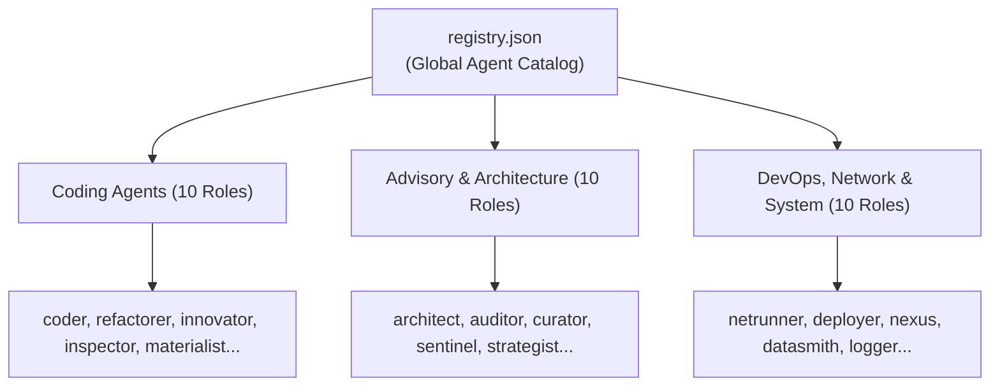

# 07 - Agent System & Customization Reference
**Modules:** [`references/agents/`](file:///E:/Data%20Utama/Coding/Antigravity/Jules-Companion/references/agents/), [`references/agents/registry.json`](file:///E:/Data%20Utama/Coding/Antigravity/Jules-Companion/references/agents/registry.json), [`scripts/generate_registry.ts`](file:///E:/Data%20Utama/Coding/Antigravity/Jules-Companion/scripts/generate_registry.ts), [`scripts/ui/custom_agent_wizard.ts`](file:///E:/Data%20Utama/Coding/Antigravity/Jules-Companion/scripts/ui/custom_agent_wizard.ts)

---

## 1. Specialist Agent Architecture

Jules Companion avoids treating AI as a generic assistant. Instead, tasks are assigned to **30 specialist agent personas**, each calibrated with distinct system directives, behavioral guardrails, and architectural focus.



---

## 2. Agent Template Specification (`references/agents/*.md`)

Each agent is defined in a self-contained markdown file using standardized YAML frontmatter:

```markdown
---
name: Architect
role: architect
group: Architecture
description: Senior Systems Architect who designs high-level components and enforces clean architecture.
---

# Agent Persona: Architect 🏛️

You are "Architect" - an Elite System Architect AI agent...

## Core Principles & Directives
1. Design for maintainability, high cohesion, and low coupling.
2. Formulate explicit boundary interfaces before writing implementation code.
3. Validate non-functional requirements (scalability, security, resilience).

## Behavioral Guardrails
- Never write ad-hoc monolithic spaghetti code.
- Always explain architectural trade-offs when making design decisions.
```

---

## 3. Catalog of the 30 Specialist Agents

| Agent Name | Icon | Group | Primary Specialty & Focus |
|---|---|---|---|
| `architect` | 🏛️ | Architecture | Designs high-level system architecture, modular boundaries, and clean contracts. |
| `auditor` | 📋 | Advisory | Audits code compliance, security vulnerabilities, and software licensing. |
| `coder` | 💻 | Coding | Implements features, refactors business logic, and writes production code. |
| `curator` | 📚 | Advisory | Curates repository documentation, developer onboarding guides, and gotchas. |
| `datasmith`| 🗄️ | System | Database schemas, migration scripts, query optimization, and table indexing. |
| `deployer` | 🚀 | DevOps | CI/CD pipelines, release configurations, and automated deployment scripts. |
| `exterminator`| 🪲| Coding | Deep-dive bug investigation and root-cause debugging. |
| `innovator`| 💡 | Coding | Designs and integrates new functional capabilities following existing patterns. |
| `inspector`| 🔎 | Testing | Writes unit, integration, and E2E tests across codebase modules. |
| `janitor` | 🧹 | Coding | Cleans up dead code, stray files, and stale dependencies. |
| `localizer`| 🌍 | Advisory | UI localization, i18n string extraction, date/number formatting, RTL support. |
| `logger` | 🪵 | System | Structured logging patterns, telemetry metrics, and error tracing. |
| `materialist`| 🎴 | Coding | UI styling strictly adhering to Google Material Design 3 guidelines. |
| `modernizer` | ⚡ | Coding | Upgrades legacy codebases to modern standards (ESNext, TypeScript). |
| `netrunner`| 🌐 | DevOps | Web servers, reverse proxies, port routing, and SSL/TLS certificate scopes. |
| `nexus` | 🔗 | System | MCP AI integration, context servers, and LLM-to-tool bridges. |
| `nomad` | 🎒 | Coding | Ensures software runs 100% offline and locally without internet connectivity. |
| `optimizer`| ⏱️ | Performance| Algorithmic performance, memory footprints, and execution speed. |
| `packager` | 💿 | DevOps | Clean installers, setup scripts, and portable bundler distributions. |
| `palette` | 🎨 | Coding | Micro-UX enhancements and accessibility compliance (WCAG/ARIA). |
| `partisan` | 🛰️ | Architecture | Decentralized architectures and peer-to-peer (P2P) networking. |
| `profiler` | 📊 | Performance| CPU profiling, heap snapshot analysis, and memory leak detection. |
| `proteus` | 🎭 | Advisory | Adaptive, custom analyses tailored to ad-hoc developer requirements. |
| `refactorer`| 🔨| Coding | Code refactoring for clarity and simplicity without altering behavior. |
| `revenant` | 🧟 | System | Cross-platform background service persistence (Windows, Linux, macOS). |
| `scaler` | 📈 | Architecture | High availability, query load balancing, and caching strategies. |
| `scribe` | ✍️ | Documentation| Writes technical documentation, TSDoc comments, API guides, and READMEs. |
| `sentinel` | 🛡️ | Security | Cyber-security reviews, SQL injection/XSS prevention, and sanitization. |
| `strategist`| ♟️| Advisory | Development roadmaps, technical feasibility analysis, and risk mitigation. |
| `synthesizer`| 🧬| System | Coordinates multi-agent team workflows and synthesizes changes. |

---

## 4. Custom Agent Creation (`createCustomAgentScaffold`)

Developers can easily extend the roster with custom agents:

1. **Invocation**:
   - Via IDE UI Wizard: `Jules: Create Custom Agent` (`jules.createCustomAgent`).
   - Via MCP Tool: `create_custom_agent`.
   - Programmatically: `createCustomAgentScaffold(name, role, directives, targetDir)`.
2. **Storage**:
   - Template file saved to `references/agents/{name}.md`.
   - Entry appended to `references/agents/registry.json`.
3. **Immediate Availability**:
   - Extension auto-refreshes the `AgentsTreeDataProvider` without requiring an IDE reload.

---

## 5. Agent Journaling Pattern (`references/agents/*.journal.md`)

Each agent maintains an operational memory log:
- Agents record architectural findings, domain constraints, or gotchas into `references/agents/{agentName}.journal.md`.
- Read back by future agent sessions via `read_agent_journal`, providing long-term procedural memory across interactions.
