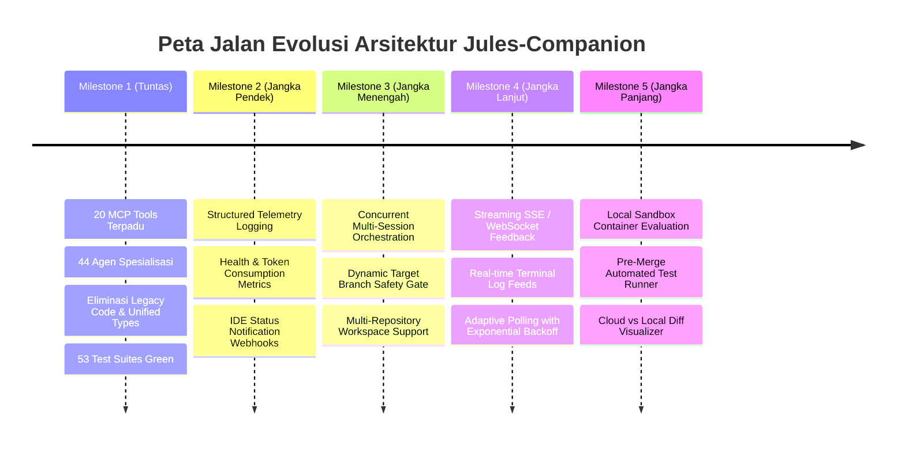

# 🛡️ Panduan Keberlanjutan Kode, Quality Assurance & Roadmap Jules-Companion

Dokumen ini adalah **pedoman resmi tata kelola rekayasa perangkat lunak** bagi pengembang, kontributor, dan AI Coding Agent untuk menjaga konsistensi, kebersihan arsitektur, dan keberlanjutan kode (*code sustainability*) pada repositori **`jules-companion`**.

---

## 1. Prinsip Inti Keberlanjutan Arsitektur (Core Principles)

Untuk memastikan proyek ini tetap lincah, mudah dipelihara, dan bebas dari akumulasi *technical debt*, setiap penambahan atau pembaruan kode wajib mematuhi lima pilar berikut:

### A. Filosofi Ponytail (Strict YAGNI & Deletion Over Addition)
* **YAGNI (You Aren't Gonna Need It)**: Jangan pernah membuat abstraksi spekulatif (seperti *interface* yang hanya memiliki satu implementasi, *factory* yang hanya menghasilkan satu produk, atau *config flag* untuk nilai yang tidak pernah berubah).
* **Prioritaskan Pustaka Bawaan (Standard Library First)**: Gunakan kapabilitas native Node.js (`fs`, `path`, `child_process`, `node:test`, `node:assert`, `https`) sebelum menambahkan dependensi *npm* pihak ketiga.
* **Shortest Working Diff**: Sentuh hanya baris-baris target yang esensial. Hindari refaktorisasi gaya penulisan (*stylistic reformatting*) atau penataan ulang yang tidak diminta pada baris yang tidak terkait.
* **Pemberantasan Kode Usang (*Dead Code Pruning*)**: Hapus berkas, skrip, dan interface yang tidak lagi dipanggil. Pemusnahan kode lama lebih berharga daripada penambahan lapisan pembungkus baru.

### B. Arsitektur Tipe Terpadu (Unified Core Types)
* Seluruh definisi model data, antarmuka sesi, opsi fungsi, dan kontrak MCP terpusat di satu berkas: [`scripts/core/types.ts`](file:///e:/Data%20Utama/Coding/Antigravity/Jules-Companion/scripts/core/types.ts).
* **Dilarang keras menduplikasi tipe data** di direktori modul cabang (misalnya `scripts/mcp/types.ts` telah dieliminasi dan disatukan ke `scripts/core/types.ts`).
* Pertahankan *strict typing*: Hindari penggunaan `any` tanpa alasan jelas pada data struktur inti. Gunakan `unknown` dengan validasi runtime skema (seperti **Zod**) pada batas input pengguna/MCP.

### C. Kebijakan Kepatuhan 100% TSDoc (TSDoc Coverage Gate)
* Setiap simbol yang diekspor (`export function`, `export class`, `export interface`, `export const`) di bawah `scripts/**/*.ts` **wajib** memiliki blok komentar TSDoc berformat standar dengan tag `@param` dan `@returns` (serta `@throws` jika melemparkan eksepsi).
* Setiap berkas TypeScript di direktori `scripts/` **wajib** memiliki header blok modul di baris pertama:
  ```typescript
  /**
   * @module nama_modul
   * @description Deskripsi tanggung jawab modul secara ringkas dan padat.
   */
  ```
* Kepatuhan ini diaudit secara otomatis di setiap eksekusi `npm test` melalui [`tests/doc_coverage.test.ts`](file:///e:/Data%20Utama/Coding/Antigravity/Jules-Companion/tests/doc_coverage.test.ts). Jika ada satu saja simbol yang tidak memiliki dokumentasi lengkap, *build pipeline* akan digagalkan.

### D. Tata Kelola Hierarki Berlapis Sentrux (Sentrux Layering Governance)
Arsitektur kode dipantau secara otomatis oleh **Sentrux** (`.sentrux/rules.toml`) dengan aturan batas dependensi 6-tingkat:
```
Tier 0: tests/            --> Menguji semua layer di bawahnya
Tier 1: interfaces/       --> mcp_server.ts, sync_global.ts (Entrypoint)
Tier 2: mcp_modules/      --> scripts/mcp/* (Registri dan definisi tool)
Tier 3: workflows/        --> deploy_session.ts, merge_session.ts, auto_process.ts, setup.ts
Tier 4: client/           --> jules_client.ts, scripts/client/* (REST HTTP client)
Tier 5: foundation/       --> scripts/core/*, utils.ts, generate_registry.ts
```
* **Aturan Mutlak**: Modul di layer bawah **dilarang mengimpor** modul di layer atasnya.
* **Zero Cyclical Dependencies**: `max_cycles = 0`. Tidak boleh ada siklus dependensi lingkaran antar-berkas.

### E. Ketahanan Lintas Platform (Windows File System Resilience)
* **Penanganan Kunci Berkas (*File Handle Locking*)**: Sistem operasi Windows sering kali mengunci direktori `.git` atau berkas sementara sesaat setelah proses anak (*child process*) selesai.
* Setiap operasi penghapusan direktori sementara (seperti `temp_test_dir_*` di unit test atau `scratch/` di staging) **wajib dibungkus dalam blok `try/catch`** atau menyertakan opsi `{ recursive: true, force: true, maxRetries: 5, retryDelay: 50 }` untuk mencegah kesalahan `EPERM: Permission denied`.
* Gunakan selalu `path.join()` dan resolusi path absolut agar konsisten di Windows (CRLF, backslash) maupun Linux/macOS (LF, forward slash).

---

## 2. Pola Arsitektur: Programmatic Core Pattern

Aplikasi ini memisahkan secara tegas antara **logika bisnis murni** dengan **antarmuka pemanggil** (CLI dan MCP Server):

```
┌─────────────────────────────────┐       ┌──────────────────────────────────┐
│   CLI Scripts (Terminal User)   │       │   MCP Tools (AI Agent via stdio) │
│ - scripts/deploy_session.ts     │       │ - scripts/mcp/tools/*.ts         │
│ (parse process.argv, log stdout)│       │ (parse JSON-RPC, validate Zod)   │
└────────────────┬────────────────┘       └─────────────────┬────────────────┘
                 │                                          │
                 └────────────────────┬─────────────────────┘
                                      ▼
                    ┌───────────────────────────────────┐
                    │      PROGRAMMATIC CORE FUNCTIONS  │
                    │ - deploySessionCore(opts)         │
                    │ - mergeSessionCore(opts)          │
                    │ - autoProcessCore(opts)           │
                    │ - runSetup(opts)                  │
                    │ (Pure, no process.exit, typed)    │
                    └─────────────────┬─────────────────┘
                                      ▼
                    ┌───────────────────────────────────┐
                    │      FOUNDATION & CLIENT API      │
                    │ - scripts/core/git.ts             │
                    │ - scripts/core/storage.ts         │
                    │ - scripts/client/jules_api.ts     │
                    └───────────────────────────────────┘
```

### Karakteristik Fungsi Core (`*Core`):
1. **Bebas Mutasi Global**: Tidak membaca atau memodifikasi `process.argv` maupun variabel lingkungan global secara sembarangan.
2. **Bebas `process.exit()`**: Tidak pernah menghentikan proses runtime. Jika terjadi kegagalan, kembalikan objek berstatus `{ success: false, output: string, error?: string }` atau lemparkan `Error` tertangkap.
3. **Parameter Objek Terstruktur**: Menerima parameter terdefinisi di `scripts/core/types.ts` (`DeploySessionOptions`, `MergeSessionOptions`, `AutoProcessOptions`, dll).
4. **Reusabilitas Ganda**: Dapat dipanggil dengan aman baik dari baris perintah terminal maupun dari server MCP stdio tanpa risiko mematikan server JSON-RPC.

---

## 3. Piramida Pengujian & Standar Quality Assurance (53 Tests)

Seluruh perubahan kode harus melewati **53 pengujian unit & integrasi** (24 suites) dengan tingkat kelulusan 100%:

```bash
# Menjalankan kompilasi TypeScript dan seluruh test suite
npm test
```

### Peta Cakupan Pengujian:
| Berkas Pengujian | Jenis Pengujian | Komponen yang Divalidasi |
| :--- | :--- | :--- |
| [`tests/doc_coverage.test.ts`](file:///e:/Data%20Utama/Coding/Antigravity/Jules-Companion/tests/doc_coverage.test.ts) | Tata Kelola & Standar | Memastikan 100% simbol ter-TSDoc, 100% header `@module`, dan 100% agen di `registry.json` memiliki file markdown. |
| [`tests/unit_mcp_registry.test.ts`](file:///e:/Data%20Utama/Coding/Antigravity/Jules-Companion/tests/unit_mcp_registry.test.ts) | Unit Test MCP | Mendaftarkan tepat 20 tool MCP, memvalidasi skema input Zod, deskripsi, dan registri. |
| [`tests/mcp.test.ts`](file:///e:/Data%20Utama/Coding/Antigravity/Jules-Companion/tests/mcp.test.ts) | Integrasi MCP | Menjalankan proses `dist/mcp_server.js` via stdio, mengirim request JSON-RPC asli, dan memeriksa response `tools/list`. |
| [`tests/merge_session.test.ts`](file:///e:/Data%20Utama/Coding/Antigravity/Jules-Companion/tests/merge_session.test.ts) | Keselamatan Git | Menguji `checkSafetyGate`, pencegahan race condition sesi aktif, rollback working tree, dan isolasi stash. |
| [`tests/deploy_session.test.ts`](file:///e:/Data%20Utama/Coding/Antigravity/Jules-Companion/tests/deploy_session.test.ts) | Alur Sesi Cloud | Menguji opsi CLI, fallback argumen, validasi tipe sesi (`start`/`review`), dan penolakan agen tidak valid. |
| [`tests/setup.test.ts`](file:///e:/Data%20Utama/Coding/Antigravity/Jules-Companion/tests/setup.test.ts) | Staging Workspace | Menguji pembuatan folder `.jules-companion/`, template agen referensi, entri `.gitignore`, dan konfigurasi platform. |
| [`tests/auto_process.test.ts`](file:///e:/Data%20Utama/Coding/Antigravity/Jules-Companion/tests/auto_process.test.ts) | Otomasi Sesi | Menguji polling otonom, penanganan daftar sesi kosong secara aman, dan auto-approval plan. |
| [`tests/jules_client.test.ts`](file:///e:/Data%20Utama/Coding/Antigravity/Jules-Companion/tests/jules_client.test.ts) | Klien REST API | Menguji kegagalan saat API key kosong, format output JSON, dan parsing sesi cloud. |
| [`tests/slash_commands.test.ts`](file:///e:/Data%20Utama/Coding/Antigravity/Jules-Companion/tests/slash_commands.test.ts) | Antarmuka AI IDE | Memvalidasi translasi perintah obrolan IDE (`/jules-deploy`, `/jules-auto`, `/jules-merge`, dll) ke payload MCP asli dan string CLI. |
| [`tests/generate_registry.test.ts`](file:///e:/Data%20Utama/Coding/Antigravity/Jules-Companion/tests/generate_registry.test.ts) | Registri Dinamis | Membaca direktori `references/agents/*.md` dan menghasilkan berkas `registry.json` terindeks. |
| [`tests/utils.test.ts`](file:///e:/Data%20Utama/Coding/Antigravity/Jules-Companion/tests/utils.test.ts) | Utilitas Inti | Menguji `parseArgs`, `runGit`, format tanggal DD-MM-YYYY, `runDoctorChecks`, pembacaan jurnal, dan penyimpanan atomik `loadSessions`/`saveSessions`. |
| [`tests/e2e.test.ts`](file:///e:/Data%20Utama/Coding/Antigravity/Jules-Companion/tests/e2e.test.ts) | Integrasi Menyeluruh | Menjalankan siklus lengkap inisialisasi setup hingga simulasi deployment sesi offline. |

---

## 4. Protokol Ekstensi Fitur (Feature Extension Protocols)

### A. Menambahkan Agen Spesialisasi Baru
1. Buat berkas baru di `references/agents/<nama_agen>.md`.
2. Format berkas harus mencakup:
   ```markdown
   You are "<NamaAgen>" 🚀 - a [Deskripsi Peran] agent who [tugas spesifik].

   CRITICAL BEHAVIORAL DIRECTIVES:
   1. [Arahan Utama 1]
   2. [Arahan Utama 2]

   BOUNDARIES:
   - DO: [Hal yang wajib dilakukan]
   - DO NOT: [Hal yang dilarang keras]
   ```
3. Regenerasi berkas indeks registri agen:
   ```bash
   npm run registry
   ```
4. Jalankan `npm test` untuk memastikan `tests/doc_coverage.test.ts` memverifikasi keselarasan 100% antara berkas markdown dan entri `registry.json`.

### B. Menambahkan Tool MCP Baru
1. Tentukan kategori domain di `scripts/mcp/tools/`:
   * Siklus hidup & kontrol sesi ➔ [`scripts/mcp/tools/session_tools.ts`](file:///e:/Data%20Utama/Coding/Antigravity/Jules-Companion/scripts/mcp/tools/session_tools.ts)
   * Template agen & registri ➔ [`scripts/mcp/tools/agent_tools.ts`](file:///e:/Data%20Utama/Coding/Antigravity/Jules-Companion/scripts/mcp/tools/agent_tools.ts)
   * Diagnostik & infrastruktur ➔ [`scripts/mcp/tools/system_tools.ts`](file:///e:/Data%20Utama/Coding/Antigravity/Jules-Companion/scripts/mcp/tools/system_tools.ts)
2. Definisikan skema validasi runtime menggunakan **Zod**:
   ```typescript
   const NewActionSchema = z.object({
     targetDir: z.string().optional(),
     param: z.string()
   });
   ```
3. Buat definisi objek `McpToolDefinition` dengan blok TSDoc lengkap:
   ```typescript
   {
     name: 'new_action',
     description: 'Deskripsi jelas fungsionalitas tool untuk panduan LLM.',
     inputSchema: {
       type: 'object',
       properties: {
         param: { type: 'string', description: 'Deskripsi parameter' }
       },
       required: ['param']
     },
     execute: async (args: any) => {
       const parsed = NewActionSchema.safeParse(args);
       if (!parsed.success) {
         return { content: [{ type: 'text', text: `Validation Error: ${parsed.error.message}` }] };
       }
       // Panggil fungsi core
       return { content: [{ type: 'text', text: 'Hasil keluaran terstruktur' }] };
     }
   }
   ```
4. Tambahkan unit test di `tests/unit_mcp_registry.test.ts` dan jalankan `npm test`.

### C. Menambahkan Endpoint REST Google Jules Baru
1. Buka [`scripts/client/jules_api.ts`](file:///e:/Data%20Utama/Coding/Antigravity/Jules-Companion/scripts/client/jules_api.ts).
2. Manfaatkan helper terisolasi `request` dan `getApiKey`:
   ```typescript
   /**
    * Memanggil endpoint REST Google Jules baru.
    * @param resourceId - Identifier sumber daya target
    * @param targetDir - Direktori target opsional untuk resolusi kredensial
    * @returns Objek respons JSON dari API
    * @throws Error jika kredensial tidak ditemukan atau permintaan HTTP gagal
    */
   export async function newEndpointApi(resourceId: string, targetDir?: string): Promise<any> {
     const apiKey = getApiKey(targetDir);
     if (!apiKey) throw new Error('JULES_API_KEY not found in environment or .env file.');
     const headers = { 'X-Goog-Api-Key': apiKey };
     return await request(`https://jules.googleapis.com/v1alpha/${resourceId}`, {
       method: 'GET',
       headers
     });
   }
   ```

---

## 5. Peta Jalan Pengembangan Berkelanjutan (Development Roadmap)

Peta jalan ini memandu arah evolusi arsitektur sistem dari fondasi modular saat ini menuju orkestrasi *cloud-local* otonom tingkat lanjut:



### Rincian Rencana Milestone:

#### 🔹 Milestone 1: Modular Foundation & Zero-Debt Core (Tuntas ✅)
* Registrasi 20 MCP tools dengan standar JSON-RPC resmi.
* 44 profil agen spesialisasi tersusun rapi di `references/agents/` dan terindeks di `registry.json`.
* Pemisahan penuh *Programmatic Core* (`deploySessionCore`, `mergeSessionCore`, `autoProcessCore`).
* Eliminasi seluruh kode usang Python evals dan duplikasi tipe MCP ke `scripts/core/types.ts`.
* 53 test suites lulus 100% dengan audit otomatis 100% TSDoc coverage dan 0 cycle violations di Sentrux.

#### 🔹 Milestone 2: Telemetri Terstruktur & Observabilitas Sesi (Jangka Pendek 🎯)
* **Structured NDJSON Logger**: Mengimplementasikan pencatatan log terstruktur di `.jules-companion/logs/session-events.ndjson` untuk melacak riwayat interaksi dan respon API.
* **Metric Tracker**: Mengukur latensi respon API, estimasi konsumsi token pada sesi cloud, dan rasio keberhasilan penggabungan patch.
* **Notification Webhook**: Memberikan sinyal visual/audio ke IDE ketika sesi cloud berpindah status ke `COMPLETED` atau memerlukan input pengguna (`AWAITING_USER_INPUT`).

#### 🔹 Milestone 3: Orkestrasi Multi-Sesi & Multi-Repositori (Jangka Menengah 🚀)
* **Dynamic Branch Safety Gate**: Mengembangkan gerbang keselamatan agar tidak memblokir merge secara global jika sesi cloud yang aktif menyasar branch yang berbeda dari branch lokal yang sedang dibuka.
* **Multi-Repo Context Resolver**: Memungkinkan satu instansi MCP server melayani beberapa repositori lokal secara independen melalui parameter `targetDir` yang terisolasi.
* **Batch Auto-Process**: Meningkatkan efisiensi `auto_process` untuk menangani puluhan sesi paralel dengan pembatasan *rate-limit* adaptif.

#### 🔹 Milestone 4: Streaming Real-time SSE / WebSocket (Jangka Lanjut 🌐)
* **Real-time Event Stream**: Menggantikan mekanisme polling diskrit dengan Server-Sent Events (SSE) atau WebSocket dari Google Jules REST API saat fitur tersebut dirilis upstream.
* **Live Step-by-Step Terminal Feed**: Menampilkan proses berpikir (*chain of thought*) dan aktivitas terminal agen cloud secara langsung di terminal lokal pengembang.

#### 🔹 Milestone 5: Validasi Patch di Sandbox Lokal Sebelum Penggabungan (Jangka Panjang 🔬)
* **Local Container Pre-flight**: Menjalankan patch hasil generasi agen cloud di dalam lingkungan kontainer Docker/isolated runner sementara untuk memvalidasi apakah `npm test` atau `cargo test` lulus sebelum patch di-merge ke branch pengembang.
* **Diff Visualizer**: Menghasilkan antarmuka web interaktif lokal untuk meninjau baris demi baris perubahan kode sebelum persetujuan merge dilakukan.

---

## 6. Checklist Kesiapan Kontribusi (PR Readiness Gate)

Sebelum mengajukan perubahan kode atau membuat Pull Request, pastikan seluruh daftar periksa berikut terpenuhi:

- [ ] **Bebas Mutasi Global**: Tidak ada penambahan mutasi `process.argv` atau panggilan `process.exit()` pada modul di dalam `scripts/core/`, `scripts/mcp/`, atau `scripts/client/`.
- [ ] **100% TSDoc Coverage**: Seluruh fungsi, interface, dan tipe data yang diekspor memiliki komentar TSDoc ber-tag `@param` dan `@returns`.
- [ ] **Header Modul Lengkap**: Berkas `.ts` baru menyertakan header `@module`.
- [ ] **53 Unit & Integration Tests Pass**: Perintah `npm test` berjalan sukses tanpa ada kegagalan.
- [ ] **Kepatuhan Sentrux**: Perintah `npm run sentrux:check` melaporkan 0 pelanggaran hierarki arsitektur.
- [ ] **Sinkronisasi Global Bersih**: Perintah `npm run sync` menyelaraskan build ke konfigurasi IDE tanpa galat.
- [ ] **Dokumentasi Selaras**: Pembaruan fungsional telah dicerminkan pada [`README.md`](file:///e:/Data%20Utama/Coding/Antigravity/Jules-Companion/README.md), [`README.id.md`](file:///e:/Data%20Utama/Coding/Antigravity/Jules-Companion/README.id.md), dan berkas panduan di direktori [`docs/`](file:///e:/Data%20Utama/Coding/Antigravity/Jules-Companion/docs).
