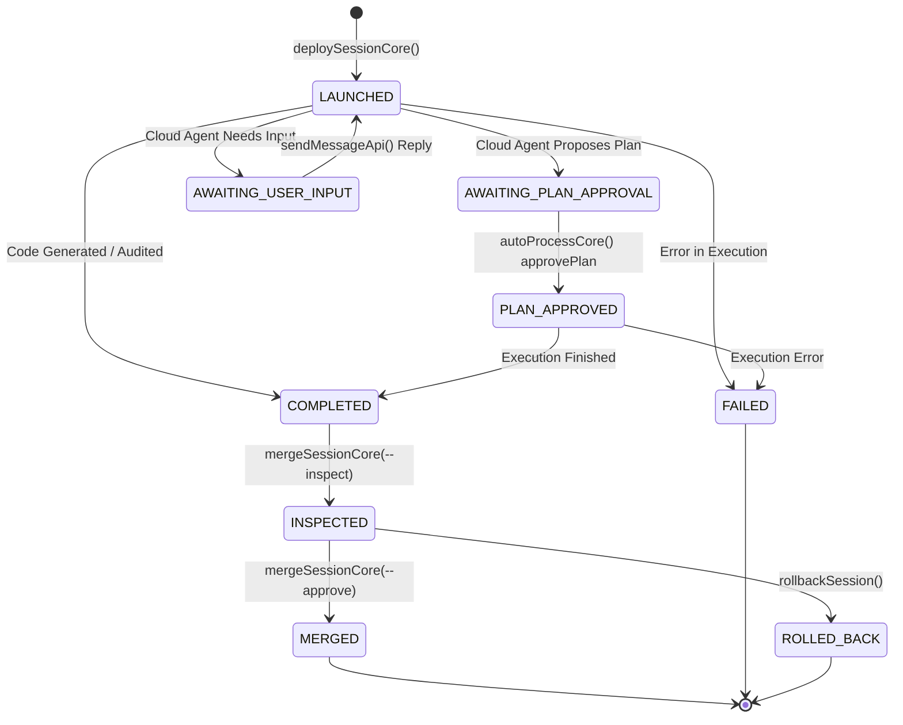

# Panduan & Dokumentasi Lengkap Aplikasi Jules Companion

`jules-companion` adalah sebuah asisten AI ko-pilot dan alat orkestrasi baris perintah (CLI & MCP) yang dibangun dengan TypeScript. Tujuan utamanya adalah menjadi jembatan cerdas dan aman yang mengoordinasikan interaksi antara pengembang (melalui terminal lokal, Git, dan AI Agent) dengan **Google Jules REST API** (lingkungan eksekusi tugas berbasis *cloud sandbox*).

Aplikasi ini mengotomatiskan seluruh siklus hidup sesi cloud (*cloud session lifecycle*), peninjauan kode terisolasi (*isolated branch review*), ekstraksi patch unidiff, penggabungan aman (*safe merge* dengan *git stash*), serta menyediakan katalog 30+ agen AI spesialis (*specialized domain agents*).

---

## 1. Tiga Antarmuka Akses (Interaction Modalities)

Jules-Companion dirancang fleksibel dengan 3 cara penggunaan yang saling melengkapi:

```
                  ┌─────────────────────────────────────────────────┐
                  │              PENGGUNA / DEVELOPER               │
                  └───────┬─────────────────┬─────────────────┬─────┘
                          │                 │                 │
                          ▼                 ▼                 ▼
             ┌─────────────────────┐ ┌─────────────┐ ┌────────────────┐
             │ AI IDE (Antigravity │ │   Slash     │ │ CLI Langsung   │
             │ Claude Code, Cursor)│ │  Commands   │ │ Terminal / npm │
             └──────────┬──────────┘ └──────┬──────┘ └────────┬───────┘
                        │                   │                 │
                        ▼                   ▼                 │
              [ Native MCP Server ]  [ Command Parser ]       │
              (20 Tools via Stdio)   (IDE Chat Prompt)        │
                        │                   │                 │
                        └─────────────┬─────┴─────────────────┘
                                      ▼
                      [ Programmatic Core Functions ]
                      - deploySessionCore()
                      - mergeSessionCore()
                      - autoProcessCore()
                      - runSetup()
                                      │
                                      ▼
                       [ Google Jules Cloud REST API ]
```

### A. Native MCP Server (Model Context Protocol)
- Terintegrasi langsung dengan Antigravity IDE, Claude Code, OpenCode, Cursor, dan Windsurf.
- Menyediakan **20 tools bawaan** yang dipanggil secara otonom oleh LLM melalui protokol JSON-RPC standar.
- Server dijalankan dengan:
  ```bash
  node dist/mcp_server.js
  ```

### B. Slash Commands (Shortcut Obrolan AI)
Memudahkan pengguna mengeksekusi tindakan kompleks langsung dari jendela obrolan IDE:
- `/jules-deploy <agent> "<task>"`: Mendeploy sesi cloud mode coding langsung.
- `/jules-review <agent> "<task>"`: Mendeploy sesi audit-only yang menghasilkan laporan Markdown.
- `/jules-auto`: Menjalankan auto-process untuk menyetujui plan atau membalas prompt yang macet.
- `/jules-inspect <sessionId>`: Mengunduh patch ke branch isolasi dan membuat laporan review.
- `/jules-merge <sessionId>`: Menggabungkan patch yang telah ditinjau ke branch target.
- `/jules-status`: Menampilkan ringkasan status seluruh sesi terdaftar.

### C. CLI Terminal Langsung (npm scripts)
Bagi pengembang yang menyukai kontrol manual di terminal:
```bash
npm run setup                                # Inisialisasi workspace lokal
npm run deploy -- --type start --agents bolt --task "Optimasi query"
npm run merge -- --inspect <sessionId>       # Stage 1: Inspeksi patch
npm run merge -- --approve <sessionId>       # Stage 2: Merge ke branch utama
npm run client -- list                       # Menampilkan sesi via API
```

---

## 2. Katalog 20 MCP Tools & Pembagian Kategori

Katalog MCP Jules-Companion dibagi menjadi 5 modul domain independen:

### I. Discovery & Health Tools
1. **`list_agents`**: Menampilkan daftar seluruh agen yang tersedia beserta peran, grup, dan file referensinya.
2. **`get_agent_info`**: Mengambil instruksi sistem (*system prompt*) lengkap dari profil agen tertentu.
3. **`list_sources`**: Menampilkan daftar repositori GitHub yang terhubung dengan akun Google Jules.
4. **`run_doctor`**: Menjalankan diagnosa lingkungan (.env, API Key, Git remote, GitHub CLI, Node.js).
5. **`create_custom_agent`**: Membuat agen spesialisasi baru lengkap dengan file Markdown dan pembaruan registry.

### II. Session Lifecycle & Deployment Tools
6. **`deploy_session`**: Membuat dan meluncurkan sesi baru di cloud dengan parameter `type`, `agents`, `task`, `mode`, `branch`.
7. **`get_session_status`**: Mengambil status runtime terkini dari API Google Jules (`state`, `url`, `activities`).
8. **`cancel_session`**: Membatalkan sesi aktif atau antrean di server Google Jules.
9. **`send_session_message`**: Mengirimkan instruksi atau respon tambahan ke sesi yang sedang berjalan.
10. **`retry_failed_session`**: Meluncurkan ulang sesi yang gagal dengan instruksi yang disesuaikan.

### III. Multi-Agent Orchestration Tools
11. **`auto_process`**: Mem-polling sesi cloud secara otonom, otomatis menyetujui plan (`approvePlan`) dan membalas prompt.
12. **`deploy_team`**: Meluncurkan tim agen berdasarkan preset teruji (`full-audit`, `feature-sprint`, `refactor-boost`).
13. **`setup_workspace`**: Menginisialisasi staging workspace lokal (`.jules-companion/`, `.gitignore`, `sessions.json`).

### IV. Git & Pull Request Bridge Tools
14. **`merge_session`**: Menjalankan inspeksi Tahap 1 (`--inspect`) atau penggabungan Tahap 2 (`--approve`).
15. **`pull_session_diff`**: Mengekstrak patch mentah unidiff tanpa melakukan checkout branch.
16. **`checkout_session_branch`**: Membuat feature branch terisolasi (`jules/<agent>-<sessionId>`) dan menerapkan patch.
17. **`create_github_pr`**: Membuat GitHub Pull Request resmi menggunakan `gh` CLI untuk sesi yang telah selesai.

### V. Knowledge & Safety Tools
18. **`read_agent_journal`**: Membaca catatan pembelajaran yang dicatat oleh agen di `.jules/<agent>.md`.
19. **`get_review_reports`**: Memindai dan membuat daftar laporan audit di `docs/jules-reviews/`.
20. **`rollback_session`**: Merestorasi stash yang tertinggal atau mengembalikan worktree ke keadaan bersih (*clean state*).

---

## 3. Finite State Machine (FSM) Siklus Hidup Sesi Cloud

Eksekusi tugas di Google Jules Sandbox VM mengikuti transisi status terstruktur:



- **`AWAITING_PLAN_APPROVAL`**: Agen merencanakan file mana saja yang akan diubah dan menunggu konfirmasi. `auto_process` akan mengirim `POST ...:approvePlan`.
- **`AWAITING_USER_INPUT`**: Agen menanyakan klarifikasi desain. `auto_process` mengirim jawaban standar atau kustom.
- **`COMPLETED`**: Agen selesai menulis kode dan menghasilkan artifak *unidiff git patch*. Siap diinspeksi.

---

## 4. Alur Inspeksi & Penggabungan Dua Tahap (Two-Stage Merge Engine)

Untuk mencegah rusaknya branch utama pengembang, modul `scripts/merge_session.ts` menerapkan standar keamanan Git:

```
[ Session Status: COMPLETED ]
              │
              ▼
    1. Pre-flight Git Stash Check (Simpan WIP pengembang)
              │
              ▼
    2. Safety Gate Verification (Cek apakah ada sesi lain yang masih aktif)
              │
              ├───────────────────────────────────────────────────────┐
              │                                                       │
              ▼ Tahap 1 (--inspect)                                  ▼ Tahap 2 (--approve)
     [ Unduh Unidiff Patch ]                                [ Checkout Target Branch ]
              │                                             (misal: main)
              ▼                                                       │
     [ Buat Branch Isolasi ]                                          ▼
     (jules/review-<sessionId>)                             [ Merge Branch Review ]
              │                                             (git merge --no-edit)
              ▼                                                       │
     [ Uji Terap: git apply --check ]                                 ▼
              │                                             [ Hapus Branch Review ]
              ▼                                                       │
     [ Buat Laporan Markdown ]                                        ▼
     (docs/jules-reviews/...)                               [ Update sessions.json -> merged ]
              │                                                       │
              └──────────────────────────┬────────────────────────────┘
                                         │
                                         ▼
                             3. Restore Git Stash Pop
                             (WIP pengembang kembali utuh)
```

### Jaminan Keamanan:
1. **Tidak Ada Kehilangan Data**: Perubahan lokal pengembang yang belum di-commit selalu diamankan melalui *unique git stash* sebelum cabang diganti.
2. **Tidak Ada Konflik Antarsesi**: Gerbang keamanan (*Safety Gate*) memblokir penggabungan jika mendeteksi adanya sesi cloud lain yang masih berjalan dan memodifikasi kode.
3. **Tinjauan Terisolasi**: Kode hasil generasi AI diuji terap di cabang isolasi, memberikan keleluasaan bagi pengembang untuk menjalankan unit test lokal sebelum menyetujui penggabungan ke branch utama.

---

## 5. Direktori & Penyimpanan State (`.jules-companion/`)

Struktur penyimpanan lokal dibuat rapi dan tidak mengotori repositori:

```
<project-root>/
├── .jules-companion/             # [GIT-IGNORED] Folder staging internal
│   ├── config.json               # Konfigurasi platform & versi
│   ├── sessions.json             # Basis data lokal riwayat sesi (atomic write)
│   ├── references/               # Salinan template agen lokal
│   │   └── agents/*.md           # 30+ template prompt agen
│   └── scratch/                  # Patch unduhan sementara (*.patch)
├── docs/
│   ├── jules-reviews/            # Laporan audit mode 'review' & hasil Stage 1
│   └── codebase-architecture-map.md
└── .gitignore                    # Otomatis ditambahkan '.jules-companion/'
```

---

## 6. Panduan Diagnostik & Pemecahan Masalah (Troubleshooting)

| Gejala Masalah | Penyebab Umum | Langkah Solusi |
| :--- | :--- | :--- |
| `Error: JULES_API_KEY not found` | Kredensial API belum disetel di lingkungan sistem. | Buat file `.env` di akar proyek atau ekspor `export JULES_API_KEY="AIza..."`. |
| `Error: No git remote origin url configured` | Proyek lokal belum dihubungkan ke GitHub. | Jalankan `git remote add origin https://github.com/<owner>/<repo>.git`. |
| `Execution Blocked: One or more active sessions...` | Ada sesi agen lain yang masih berjalan di cloud. | Tunggu hingga sesi selesai, batalkan sesi dengan `cancel_session`, atau jalankan `/jules-auto`. |
| `Git patch dry-run failed` | Konflik baris kode antara patch cloud dengan revisi lokal terbaru. | Periksa perbedaan baris kode pada branch `jules/review-...` dan selesaikan konflik secara manual. |
| `Missing TSDoc block comment` pada `npm test` | Ada fungsi atau interface baru yang diekspor tanpa komentar TSDoc ber-tag `@param`/`@returns`. | Tambahkan blok dokumentasi `/** ... @param ... @returns ... */` di atas simbol terkait. |
